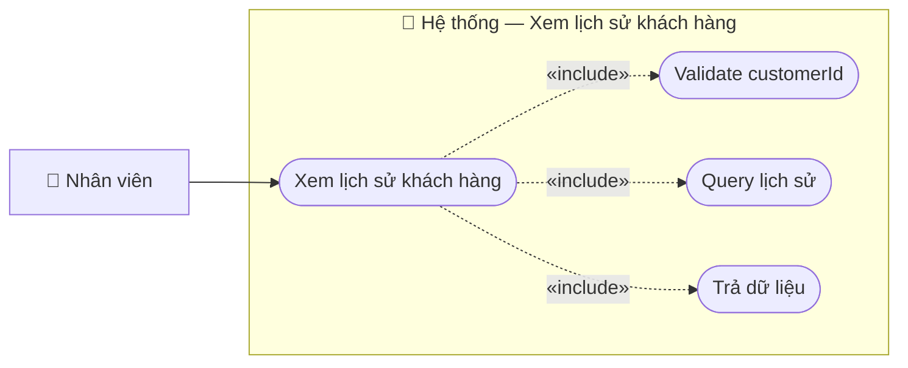

# Usecase: Xem lịch sử khách hàng

## Actor
- **Primary:** Nhân viên (`Employee`)
- **System:** JavaFX Client → TCP Socket Server (`RequestRouter`) → MariaDB

## Mô tả
Nhân viên xem lịch sử mua vé của một khách hàng: danh sách vé đã mua và tổng số tiền giao dịch.

## Tiền điều kiện
- Nhân viên đang ở màn hình Quản lý khách hàng và đã chọn một khách hàng.

## Hậu điều kiện
- Client nhận `CustomerHistoryResponseDTO` để hiển thị lịch sử và tổng tiền.

## Luồng chính
1. Nhân viên chọn khách hàng và nhấn **Xem lịch sử mua vé**:
   - `CustomerManagementController.openCustomerHistory()` mở `customer-history-view.fxml`.
2. Client gửi `ActionType.GET_CUSTOMER_HISTORY` với `CustomerHistoryRequestDTO { customerId }`.
3. Server `CustomerServiceImpl.getCustomerHistory(...)`:
   - Validate `customerId`.
   - Query `CustomerRepository.findCustomerTicketHistory(...)` và `sumCustomerInvoiceTotalAmount(...)`.
   - Trả `CustomerHistoryResponseDTO { items, totalAmount }`.
4. Client hiển thị bảng lịch sử (`CustomerHistoryItemDTO`) và tổng tiền.

## Luồng thay thế
- **[Không có lịch sử]:** `items=[]`, `totalAmount=0`.

## Luồng lỗi
- **[Thiếu customerId]:** Server trả lỗi validation (prefix `CustomerMessages.DATA_INVALID_PREFIX`).
- **[Lỗi truy vấn]:** Server trả message hardcode `"Lỗi khi lấy lịch sử mua vé: " + <message>`.

## Dữ liệu vào (Client → Server)
| Field | Kiểu | Bắt buộc | Mô tả |
|---|---|---|---|
| `customerId` | `String` | ✓ | Mã khách hàng cần xem lịch sử. |

## Dữ liệu ra (Server → Client)
| Response.data | Kiểu | Mô tả |
|---|---|---|
| `items` | `List<CustomerHistoryItemDTO>` | Lịch sử mua vé. |
| `totalAmount` | `double` | Tổng tiền giao dịch. |

## Business Rules
- **Theo customerId:** Lịch sử/tổng tiền được thống kê theo ID khách hàng.

---

## Sơ đồ Use Case

