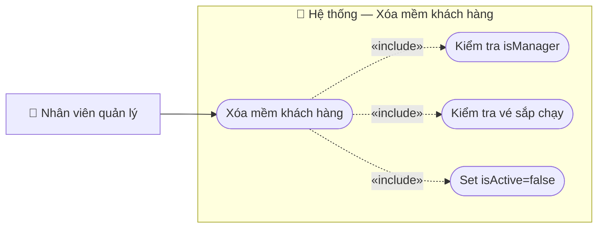

# Usecase: Xóa mềm khách hàng

## Actor
- **Primary:** Nhân viên quản lý (`Employee` với `isManager = true`)
- **Secondary:** Nhân viên thao tác (người đang đăng nhập)
- **System:** JavaFX Client → TCP Socket Server (`RequestRouter`) → MariaDB

## Mô tả
Nhân viên quản lý vô hiệu hóa (xóa mềm) một khách hàng bằng cách set `Customer.isActive=false`. Hệ thống kiểm tra quyền quản lý và không cho vô hiệu hóa khách hàng đang có vé `PAID` sắp khởi hành.

## Tiền điều kiện
- Nhân viên đã đăng nhập và có `employeeId` hợp lệ.
- Nhân viên đang ở màn hình Quản lý khách hàng và đã chọn khách hàng cần xóa mềm.

## Hậu điều kiện
- `Customer.isActive=false` trong DB; khách không còn xuất hiện trong tra cứu active và không thể cập nhật (Server chặn update inactive).

## Luồng chính
1. Nhân viên nhấn **Xóa** và xác nhận:
   - `CustomerManagementController.handleDeleteCustomer()` tạo `CustomerDeleteRequestDTO { customerId, requestEmployeeId }` và gửi `ActionType.DELETE_CUSTOMER`.
2. Server `CustomerServiceImpl.deleteCustomer(...)` trong transaction:
   - Validate DTO.
   - Kiểm tra nhân viên yêu cầu tồn tại, `EmployeeStatus.ACTIVE` và `isManager=true`:
     - Not found → `CustomerMessages.requestEmployeeNotFound(id)`
     - Inactive → `CustomerMessages.requestEmployeeInactive(id)`
     - Not manager → `CustomerMessages.MANAGER_ONLY`
   - Load `Customer`:
     - Not found → `CustomerMessages.customerNotFound(customerId)`
   - Check vé sắp khởi hành: nếu `hasUpcomingPaidTicket(...)` true → `CustomerMessages.CUSTOMER_HAS_UPCOMING_TICKET`.
   - Set `active=false` và update.
   - Trả `CustomerMessages.DELETE_SUCCESS` + `CustomerDTO`.
3. Client refresh danh sách.

## Luồng thay thế
- **[Hủy thao tác]:** Client không gửi request khi bấm Cancel.

## Luồng lỗi
- **[Thiếu employeeId]:** Client chặn và báo lỗi.
- **[Không có quyền]:** `CustomerMessages.MANAGER_ONLY`.
- **[Khách có vé sắp khởi hành]:** `CustomerMessages.CUSTOMER_HAS_UPCOMING_TICKET`.
- **[Khách không tồn tại]:** `CustomerMessages.customerNotFound(...)`.
- **[Lỗi hệ thống]:** `CustomerMessages.DELETE_FAILED_PREFIX + <message>`.

## Dữ liệu vào (Client → Server)
| Field | Kiểu | Bắt buộc | Mô tả |
|---|---|---|---|
| `customerId` | `String` | ✓ | Khách hàng cần xóa mềm. |
| `requestEmployeeId` | `String` | ✓ | Nhân viên yêu cầu xóa (manager + ACTIVE). |

## Dữ liệu ra (Server → Client)
| Field | Kiểu | Mô tả |
|---|---|---|
| `success` | `boolean` | Kết quả xử lý. |
| `message` | `String` | Thành công: `CustomerMessages.DELETE_SUCCESS`. |
| `data` | `CustomerDTO` | Khách hàng sau khi bị set inactive. |

## Business Rules
- **Xóa mềm:** Không xóa record; chỉ set `isActive=false`.
- **Chỉ manager:** Nhân viên yêu cầu phải ACTIVE và `isManager=true`.
- **Không xóa khi có vé sắp chạy:** Từ chối nếu khách có vé `PAID` sắp khởi hành.

---

## Sơ đồ Use Case

