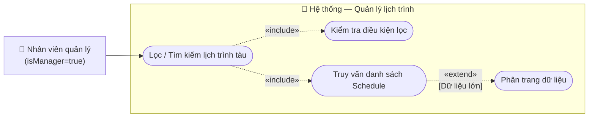

# Usecase: Lọc lịch trình tàu

## Actor
- **Primary:** Nhân viên quản lý (`Employee` với `isManager = true`)
- **System:** Server, Database

## Mô tả
Chức năng cho phép nhân viên quản lý tìm kiếm, tra cứu và lọc danh sách các lịch trình chạy tàu (Schedule) theo nhiều tiêu chí kết hợp như điểm đi, điểm đến, mã tàu, trạng thái chuyến. Chức năng này giúp người quản lý dễ dàng theo dõi, vận hành và cập nhật thông tin chuyến đi.

## Tiền điều kiện
- Nhân viên quản lý đã đăng nhập thành công vào hệ thống.
- Nhân viên quản lý đang ở màn hình chức năng **Quản lý lịch trình**.

## Hậu điều kiện
- Hệ thống hiển thị danh sách các lịch trình thỏa mãn bộ lọc. Dữ liệu trong database không bị thay đổi.

## Luồng chính
1. Nhân viên quản lý chọn chức năng "Lọc lịch trình".
2. Hệ thống hiển thị form bộ lọc bao gồm các trường:
   - Điểm đi (Ga đi)
   - Điểm đến (Ga đến)
   - Tàu (Tên / Mã tàu)
   - Trạng thái chuyến (`DRAFT`, `NOT_STARTED`, `IN_PROGRESS`, `PAUSED`, `READY`, `COMPLETED`)
   - Khoảng thời gian (Từ ngày - Đến ngày)
3. Nhân viên quản lý nhập hoặc chọn một hoặc nhiều tiêu chí lọc (không bắt buộc nhập tất cả).
4. Nhân viên quản lý ấn nút **"Lọc"** (hoặc Tìm kiếm).
5. Hệ thống tiếp nhận yêu cầu, truy vấn cơ sở dữ liệu để tìm các lịch trình (`Schedule`) khớp với *tất cả* các tiêu chí đã nhập (toán tử AND).
6. Hệ thống trả về và hiển thị danh sách lịch trình phù hợp lên màn hình lưới dữ liệu.

## Luồng thay thế
- **[Không nhập tiêu chí nào]:** Nếu nhân viên quản lý để trống toàn bộ bộ lọc và ấn "Lọc", hệ thống sẽ trả về danh sách toàn bộ lịch trình (có thể phân trang để đảm bảo hiệu năng).
- **[Xóa bộ lọc]:** Nhân viên quản lý ấn "Làm mới", hệ thống xóa trắng các tiêu chí đã nhập và tải lại toàn bộ danh sách.

## Luồng lỗi
- **[Không tìm thấy dữ liệu]:** Hệ thống truy vấn nhưng không có lịch trình nào khớp với bộ tiêu chí (ví dụ: lọc tàu SE1 trạng thái DRAFT nhưng không có). Hệ thống trả về danh sách rỗng và hiển thị thông báo: *"Không tìm thấy lịch trình phù hợp"*.
- **[Lỗi khoảng thời gian]:** Nếu nhân viên nhập "Từ ngày" lớn hơn "Đến ngày", hệ thống chặn tại client và thông báo *"Khoảng thời gian không hợp lệ"*.

## Dữ liệu vào (Client → Server)
| Field | Kiểu | Bắt buộc | Mô tả |
|---|---|---|---|
| `departureStationId` | `String` | ✗ | ID Ga đi |
| `destinationStationId` | `String` | ✗ | ID Ga đến |
| `trainId` | `String` | ✗ | ID Tàu |
| `status` | `StatusSchedule` | ✗ | Trạng thái của chuyến |
| `fromDate` | `LocalDate` | ✗ | Khởi hành từ ngày |
| `toDate` | `LocalDate` | ✗ | Khởi hành đến ngày |
| `page` | `int` | ✗ | Trang hiện tại (Mặc định: 0) |
| `size` | `int` | ✗ | Số record trên 1 trang (Mặc định: 20) |

## Dữ liệu ra (Server → Client)
Trả về một danh sách các bản ghi (List) chứa thông tin:

| Field | Kiểu | Mô tả |
|---|---|---|
| `scheduleId` | `String` | ID của lịch trình |
| `routeCode` | `String` | Mã tuyến đường |
| `departureStationName`| `String` | Tên ga đi |
| `destinationStationName`| `String` | Tên ga đến |
| `trainName` | `String` | Tên / Mã hiệu tàu |
| `departureTime` | `LocalDateTime` | Giờ khởi hành |
| `arrivalTime` | `LocalDateTime` | Giờ đến nơi |
| `status` | `StatusSchedule` | Trạng thái chuyến (`NOT_STARTED`, v.v.) |

## Business Rules
- Các tiêu chí lọc phải được kết hợp với nhau bằng điều kiện logic **AND**.
- Mặc định danh sách kết quả trả về phải được sắp xếp theo thời gian khởi hành (`departureTime`) giảm dần (chuyến mới nhất lên đầu).
- Phân quyền: Chỉ có tài khoản nhân viên có cờ `isManager = true` mới được quyền gọi API lọc lịch trình này. Nhân viên thường không có quyền truy cập chức năng Quản lý lịch trình.
- Tìm kiếm gần đúng (LIKE) đối với tên ga hoặc mã tàu nếu client truyền chuỗi text (tùy thuộc vào thiết kế UI, nhưng nếu truyền ID thì dùng Exact match).

---

## Sơ đồ Use Case

---

## 🛠 Yêu cầu cập nhật DTO / Logic (Từ BA Review)

Dựa trên quá trình phân tích nghiệp vụ, Tech Lead / Developer cần lưu ý cập nhật các DTO và Logic sau để đáp ứng đúng yêu cầu của màn hình quản lý:

1. **Input Request (Dữ liệu vào):** Bắt buộc phải thêm tham số phân trang (`page`, `size`).
   - **Lý do (Vấn đề thực tế):** Hệ thống đường sắt lưu trữ hàng nghìn lịch trình. Nếu Client bấm "Lọc" mà không truyền giới hạn số lượng (`page`, `size`), Server sẽ truy vấn và trả về toàn bộ dữ liệu cùng lúc, dẫn đến nguy cơ tràn bộ nhớ (Out of Memory) hoặc nghẽn băng thông mạng.

2. **ScheduleDTO (Dữ liệu ra):** Thêm các trường hiển thị `trainName`, `routeCode`, `departureStationName`, `destinationStationName`.
   - **Lý do (Vấn đề thực tế):** Lớp `ScheduleDTO` hiện tại chỉ chứa các ID (chuỗi UUID). Người quản lý khi nhìn vào màn hình danh sách cần đọc được **Tên tàu** (ví dụ: SE1) và **Tên ga** chứ không phải một chuỗi UUID vô nghĩa. Do đó, DTO trả về cho màn hình lưới (grid) bắt buộc phải được `JOIN` thêm thông tin chuỗi dễ đọc.

3. **Logic sắp xếp (Sorting):** Bổ sung sắp xếp mặc định theo `departureTime` giảm dần.
   - **Lý do (Vấn đề thực tế):** Hành vi người dùng khi mở màn hình quản lý lịch trình luôn là muốn xem các chuyến tàu mới nhất hoặc sắp chạy lên đầu tiên, thay vì phải lướt qua hàng nghìn chuyến tàu từ năm ngoái.
