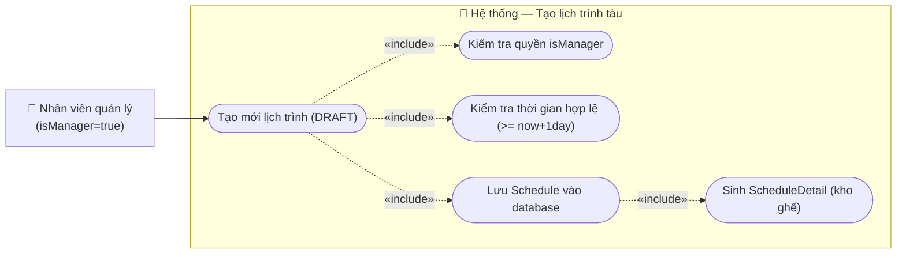

# Usecase: Tạo lịch trình tàu

## Actor
- **Primary:** Nhân viên quản lý (`Employee` với `isManager = true`)
- **System:** Server, Database

## Mô tả
Chức năng cho phép nhân viên quản lý tạo mới một lịch trình tàu chạy. Lịch trình mới tạo sẽ luôn ở trạng thái "Nháp" (`DRAFT`) để quản lý có thể tiếp tục bổ sung chi tiết (như giá vé cho từng ghế) trước khi chính thức mở bán.

## Tiền điều kiện
- Nhân viên quản lý đã đăng nhập thành công vào hệ thống.
- Nhân viên quản lý đang ở màn hình chức năng **Quản lý lịch trình**.

## Hậu điều kiện
- Một bản ghi `Schedule` mới được tạo trong database với trạng thái là `DRAFT`.
- Hệ thống ghi nhận tàu (`Train`) và tuyến đường (`Route`) tương ứng cho lịch trình này.
- Hệ thống tự động sinh toàn bộ bản ghi `ScheduleDetail` (kho ghế) tương ứng với tất cả ghế của đoàn tàu được chọn, với `priceSeat = 0` và `routeStop = null`.

## Luồng chính
1. Nhân viên quản lý đang ở giao diện Quản lý lịch trình, nhấn chọn nút **"Tạo lịch trình"**.
2. Hệ thống hiển thị form tạo lịch trình mới với các trường: Chọn Tàu, Chọn Tuyến đường, Chọn Ngày/Giờ khởi hành, Chọn Ngày/Giờ đến dự kiến.
3. Nhân viên quản lý nhập/chọn đầy đủ các thông tin bắt buộc trên form.
4. Nhân viên quản lý nhấn nút **"Xác nhận"** (hoặc "Lưu").
5. Hệ thống kiểm tra tính hợp lệ của dữ liệu đầu vào (không bỏ trống, ngày giờ hợp lệ).
6. Hệ thống tạo mới bản ghi `Schedule` với trạng thái `DRAFT`, đồng thời tự động sinh toàn bộ `ScheduleDetail` (kho ghế) cho tất cả ghế của đoàn tàu được chọn.
7. Hệ thống đóng form, hiển thị thông báo "Tạo lịch trình thành công" và làm mới lại danh sách lịch trình.

## Luồng thay thế
- **[Hủy thao tác]:** Tại bước 3, nếu quản lý không muốn tạo nữa và nhấn nút **"Hủy"** (hoặc tắt popup), hệ thống đóng giao diện nhập liệu, không lưu bất kỳ dữ liệu nào.

## Luồng lỗi
- **[Không có quyền]:** Nếu tài khoản gọi API không có cờ `isManager = true`, Server từ chối và trả về lỗi: *"Bạn không có quyền thực hiện thao tác này"*.
- **[Thời gian không hợp lệ]:** Tại bước 5, nếu `departureTime` nhỏ hơn thời điểm hiện tại cộng 1 ngày (`now() + 1 day`), hệ thống từ chối lưu và hiển thị thông báo lỗi: *"Ngày khởi hành phải cách ít nhất 1 ngày so với hôm nay"*.
- **[Giờ đến trước giờ đi]:** Tại bước 5, nếu `arrivalTime` nhỏ hơn hoặc bằng `departureTime`, hệ thống từ chối và thông báo: *"Ngày giờ đến dự kiến không được nhỏ hơn giờ khởi hành"*.
- **[Bỏ trống dữ liệu]:** Nếu quản lý nhấn Xác nhận nhưng chưa chọn Tàu, Tuyến hoặc chưa nhập đủ thời gian, hệ thống bôi đỏ các trường còn thiếu và yêu cầu điền đầy đủ.

## Dữ liệu vào (Client → Server)
| Field | Kiểu | Bắt buộc | Mô tả |
|---|---|---|---|
| `trainId` | `String` | ✓ | ID của Tàu chạy |
| `routeId` | `String` | ✓ | ID của Tuyến đường |
| `departureTime` | `LocalDateTime` | ✓ | Ngày giờ khởi hành |
| `arrivalTime` | `LocalDateTime` | ✓ | Ngày giờ đến dự kiến (bắt buộc từ BA Review) |

## Dữ liệu ra (Server → Client)
| Field | Kiểu | Mô tả |
|---|---|---|
| `scheduleId` | `String` | ID của lịch trình vừa tạo (để hiển thị hoặc chuyển hướng) |
| `status` | `StatusSchedule` | Trạng thái mặc định là `DRAFT` |

## Business Rules
- **Phân quyền:** Chỉ tài khoản có cờ `isManager = true` mới được thao tác gọi API này.
- **Trạng thái khởi tạo:** Lịch trình mới tạo luôn luôn có trạng thái bắt buộc là `DRAFT`.
- **Ràng buộc thời gian:** Thời gian khởi hành (`departureTime`) phải lớn hơn hoặc bằng thời điểm hiện tại cộng thêm ít nhất 24 giờ (`now() + 1 day`). Không cho phép tạo lịch trình tàu chạy sát giờ hoặc trong quá khứ.
- **Ràng buộc giờ đến:** `arrivalTime` phải lớn hơn `departureTime`.

---

## Sơ đồ Use Case

---

## 🛠 Yêu cầu cập nhật Database / Entity / DTO (Từ BA Review)

Để hệ thống không bị lỗi nghiệp vụ khi đưa vào vận hành, Tech Lead / Developer bắt buộc phải thực hiện các cập nhật sau khi code chức năng này:

1. **Input DTO (Form nhập liệu):** Bắt buộc bổ sung thêm tham số Ngày giờ đến dự kiến (`arrivalTime`).
   - **Lý do (Vấn đề thực tế):** Bảng `Schedule` trong Database yêu cầu phải có cả giờ đi và giờ đến. Khách hàng mua vé không thể chỉ biết lúc đi mà không biết lúc nào tới. Việc bắt hệ thống tự tính toán giờ đến dựa trên khoảng cách ga là vô cùng phức tạp và không chính xác (do còn tùy thuộc loại tàu chạy nhanh/chậm, thời gian dừng đỗ). Do đó, người quản lý phải tự nhập `arrivalTime` ngay lúc tạo lịch trình.

2. **Logic Service (Bước Lưu Database):** Khi tạo `Schedule`, bắt buộc phải tự động Generate (sinh ra) danh sách `ScheduleDetail` (Kho ghế).
   - **Lý do (Vấn đề thực tế):** Bảng `Schedule` chỉ mang ý nghĩa là "Ngày mai Tàu SE1 sẽ chạy tuyến Bắc-Nam". Cái thực sự được mang ra bán cho khách là từng cái ghế trên chuyến tàu đó (bảng `ScheduleDetail`). Nếu tạo `Schedule` xong mà hệ thống không tự động quét bảng `Carriage` (Toa) và `Seat` (Ghế) của tàu SE1 để đẻ ra 500 cái `ScheduleDetail` tương ứng, thì chuyến tàu này sẽ trống rỗng, không có ghế nào để khách chọn mua cả! (Giá vé `priceSeat` tạm thời có thể set = 0 vì đang ở trạng thái DRAFT).

3. **Xử lý RouteStop trong ScheduleDetail:** Khi generate danh sách `ScheduleDetail`, trường khóa ngoại `routeStop` bắt buộc set bằng `null`.
   - **Lý do (Vấn đề thực tế):** Nghiệp vụ của UC-006 chỉ tập trung tạo lịch trình nguyên chuyến (từ Ga gốc tới Ga đích). Lịch trình cho các ga dừng dọc đường (`RouteStop`) và phân bổ ghế cho từng chặng nhỏ sẽ được thực hiện ở một UC nâng cao khác. Hiện tại `ScheduleDetail` sinh ra đại diện cho toàn tuyến, do đó `routeStop` phải để `null`.
