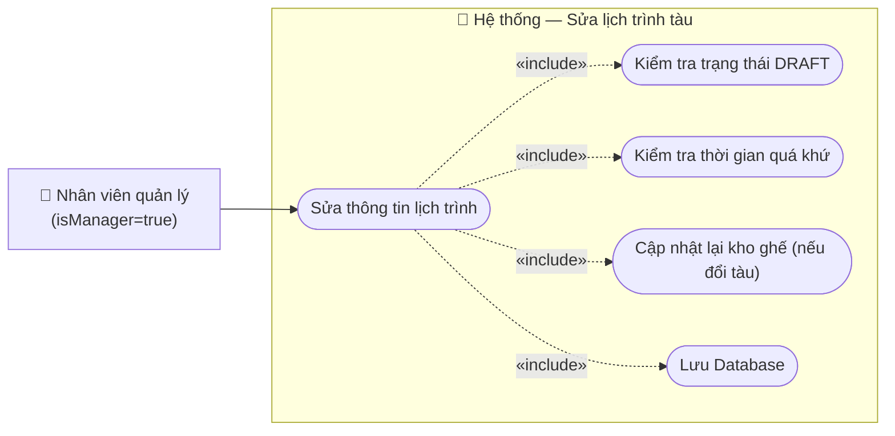

# Usecase: Sửa lịch trình tàu

## Actor
- **Primary:** Nhân viên quản lý (`Employee` với `isManager = true`)
- **System:** Server, Database

## Mô tả
Chức năng cho phép nhân viên quản lý cập nhật lại các thông tin của một lịch trình tàu đã được tạo (thay đổi Tàu, Tuyến đường, Thời gian). Việc sửa đổi này mang tính chất cấu hình và **chỉ được phép thực hiện khi lịch trình đang ở trạng thái Nháp (`DRAFT`)** — tức là chưa mở bán vé cho khách.

## Tiền điều kiện
- Nhân viên quản lý đã đăng nhập thành công vào hệ thống.
- Nhân viên quản lý đang ở giao diện danh sách **Quản lý lịch trình**.
- Lịch trình muốn sửa đổi phải đang có trạng thái là `DRAFT`.

## Hậu điều kiện
- Thông tin của bản ghi `Schedule` được cập nhật thành công trong cơ sở dữ liệu.
- Nếu có sự thay đổi về loại Tàu (Train), cấu trúc kho ghế (`ScheduleDetail`) sẽ được cập nhật lại tương ứng.

## Luồng chính
1. Nhân viên quản lý đang ở giao diện danh sách Quản lý lịch trình.
2. Nhân viên tìm đến một lịch trình có trạng thái `DRAFT` và nhấn vào nút **"Sửa lịch trình"**.
3. Hệ thống truy xuất dữ liệu hiện tại của lịch trình và hiển thị lên form sửa đổi (bao gồm: Tàu, Tuyến đường, Ngày/Giờ khởi hành, Ngày/Giờ đến dự kiến).
4. Nhân viên quản lý tiến hành chỉnh sửa một hoặc nhiều thông tin trên form.
5. Nhân viên quản lý nhấn nút **"Xác nhận"** (hoặc "Lưu").
6. Hệ thống kiểm tra tính hợp lệ của dữ liệu (thời gian khởi hành không ở quá khứ).
7. Hệ thống tiến hành cập nhật bản ghi `Schedule` trong database.
8. Hệ thống đóng form, hiển thị thông báo "Cập nhật lịch trình thành công" và tải lại danh sách.

## Luồng thay thế
- **[Hủy thao tác]:** Tại bước 4 hoặc 5, nếu nhân viên quản lý không muốn tiếp tục và nhấn "Hủy" (hoặc chọn tắt giao diện/popup), hệ thống lập tức đóng form, không lưu bất kỳ thay đổi nào.

## Luồng lỗi
- **[Sai trạng thái]:** Ở màn hình danh sách, nếu lịch trình không phải là bản nháp (`NOT_STARTED`, `READY`, v.v.), hệ thống sẽ làm mờ (disable) hoặc ẩn nút "Sửa" để ngăn chặn truy cập vào form sửa.
- **[Cố tình gọi API sai trạng thái]:** Nếu ai đó cố tình gọi API sửa cho một lịch trình đã mở bán (`status != DRAFT`), Server sẽ từ chối và báo lỗi *"Chỉ được phép sửa lịch trình khi đang ở trạng thái Nháp"*.
- **[Thời gian ở quá khứ]:** Tại bước 6, nếu nhân viên nhập "Ngày hoặc giờ khởi hành" ở quá khứ và nhấn xác nhận, hệ thống từ chối lưu và hiển thị thông báo: *"Nhập ngày hoặc giờ khởi hành ở quá khứ không hợp lệ"*. Nhân viên nhấn OK trên thông báo để quay lại form sửa.
- **[Thiếu thông tin]:** Nhân viên xóa trắng một trường bắt buộc rồi bấm Lưu, hệ thống sẽ chặn tại UI và yêu cầu điền đầy đủ.

## Dữ liệu vào (Client → Server)
| Field | Kiểu | Bắt buộc | Mô tả |
|---|---|---|---|
| `scheduleId` | `String` | ✓ | ID của lịch trình cần sửa |
| `trainId` | `String` | ✓ | ID của Tàu (có thể đổi sang tàu khác) |
| `routeId` | `String` | ✓ | ID của Tuyến đường |
| `departureTime` | `LocalDateTime` | ✓ | Giờ khởi hành mới |
| `arrivalTime` | `LocalDateTime` | ✓ | Giờ đến dự kiến mới (Được kế thừa từ BA Review của UC-006) |

## Dữ liệu ra (Server → Client)
- Trả về mã thành công (HTTP 200/204) và chuỗi thông báo kết quả.

## Business Rules
- **Chặn sửa khi đã bán vé:** Luật bất thành văn của hệ thống — chỉ được phép sửa `Schedule` khi nó là `DRAFT`. Nếu lịch trình đã chuyển sang trạng thái `READY` (mở bán) hoặc `IN_PROGRESS` (đang chạy), việc sửa Tàu hay Tuyến đường sẽ làm sai lệch toàn bộ vé mà khách hàng đã mua. Cấm tuyệt đối!
- **Đồng bộ hóa Kho ghế:** Nếu nhân viên đổi `trainId` (Ví dụ: Đổi từ Tàu SE1 sang Tàu SE3), số lượng toa và ghế của 2 tàu này là khác nhau. Hệ thống bắt buộc phải **xóa toàn bộ** các `ScheduleDetail` (ghế) cũ của lịch trình này, và **tạo mới lại toàn bộ** `ScheduleDetail` dựa trên cấu hình của con Tàu mới.
- **Ràng buộc thời gian:** `departureTime` luôn phải ở tương lai.

---

## Sơ đồ Use Case

---

## 🛠 Yêu cầu cập nhật Database / Entity / Logic (Từ BA Review)

Để đảm bảo tính toàn vẹn dữ liệu khi sửa lịch trình, Tech Lead / Developer bắt buộc phải xử lý các Logic sau trong quá trình code Service:

1. **Logic Service (Đồng bộ hóa toàn bộ kho ghế khi đổi Tàu HOẶC đổi Tuyến):**
   - **Lý do (Vấn đề thực tế):** Bảng `ScheduleDetail` (kho ghế để bán) là sự kết hợp giữa Ghế (`seatId`) và Điểm dừng (`routeStopId`). Nếu quản lý đổi sang một Tàu khác, sơ đồ toa/ghế sẽ thay đổi hoàn toàn. Tương tự, nếu quản lý đổi sang Tuyến đường khác, danh sách các ga dừng sẽ thay đổi hoàn toàn. Do đó, nếu Request gửi lên có sự thay đổi về `trainId` **HOẶC** `routeId`, hệ thống bắt buộc phải **xóa sạch** các `ScheduleDetail` cũ của lịch trình này và **Generate (sinh ra) lại toàn bộ** kho ghế mới. Nếu Developer quên bắt logic này, hệ thống sẽ lưu rác dữ liệu: Tàu chạy tuyến Hà Nội nhưng ghế lại dừng ở Nha Trang.

2. **Validation API (Chặn cứng trạng thái ở Server):**
   - **Lý do (Vấn đề thực tế):** Mặc dù UI đã làm mờ nút "Sửa" nếu lịch trình không phải là DRAFT, nhưng Developer bắt buộc phải check lại điều kiện `status == DRAFT` ở tầng Service. Đề phòng có người cố tình dùng tool (Postman) gọi thẳng vào API sửa khi tàu đang chạy. Nếu Server lọt lỗi này, toàn bộ vé khách đã mua (đang dính với ScheduleDetail cũ) sẽ bị sai lệch giờ chạy hoặc mất ghế, dẫn đến sự cố truyền thông và đền bù cực lớn.
