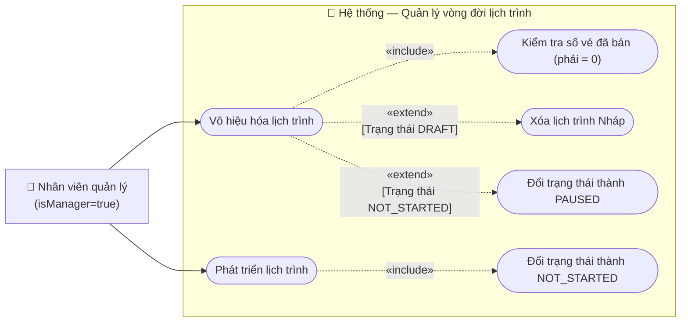

# Usecase: Vô hiệu hoá và Phát triển lịch trình tàu

## Actor
- **Primary:** Nhân viên quản lý (`Employee` với `isManager = true`)
- **System:** Server, Database

## Mô tả
Chức năng này cung cấp hai thao tác quản lý vòng đời của một lịch trình (Schedule):
1. **Phát triển (Publish):** Chuyển lịch trình từ trạng thái Nháp (`DRAFT`) sang trạng thái Mở bán / Chưa khởi hành (`NOT_STARTED`).
2. **Vô hiệu hoá (Disable/Cancel):** Hủy bỏ lịch trình. Tùy thuộc vào trạng thái hiện tại mà hệ thống sẽ có cách xử lý khác nhau (Xóa hẳn nếu là nháp, hoặc chuyển sang trạng thái Ngưng hoạt động nếu đã mở bán nhưng chưa có ai mua vé).

## Tiền điều kiện
- Nhân viên quản lý đã đăng nhập thành công vào hệ thống.
- Nhân viên quản lý đang ở màn hình chức năng **Quản lý lịch trình**.

## Hậu điều kiện
- **Nếu Phát triển:** Bản ghi `Schedule` được cập nhật trạng thái thành `NOT_STARTED`.
- **Nếu Vô hiệu hóa:** Bản ghi `Schedule` bị xóa khỏi hệ thống (nếu là `DRAFT`) hoặc được cập nhật trạng thái thành `PAUSED`/`CANCELLED` (nếu đã mở bán nhưng chưa có vé).

## Luồng chính (Vô hiệu hóa lịch trình)
1. Nhân viên quản lý đang ở giao diện danh sách lịch trình.
2. Nhân viên tìm đến một lịch trình (đang là `DRAFT` hoặc `NOT_STARTED`) và chọn hành động **"Vô hiệu hóa"**.
3. Hệ thống hiển thị hộp thoại xác nhận: *"Bạn có chắc chắn muốn vô hiệu hóa lịch trình này không?"*.
4. Nhân viên quản lý nhấn **"Xác nhận"**.
5. Hệ thống kiểm tra trạng thái và lượng vé đã bán:
   - Nếu lịch trình là `DRAFT`: Tiến hành **Xóa** bản ghi `Schedule` (và các `ScheduleDetail` liên quan) khỏi cơ sở dữ liệu.
   - Nếu lịch trình là `NOT_STARTED` nhưng chưa có bất kỳ khách nào mua vé (số ghế trống = 100%): Tiến hành **Tạm ngưng**, cập nhật trạng thái thành `PAUSED` (hoặc `CANCELLED`).
6. Hệ thống hiển thị thông báo "Vô hiệu hóa lịch trình thành công" và làm mới danh sách.

## Luồng thay thế (Phát triển lịch trình)
- **[Phát triển từ Nháp]:** 
  1. Nhân viên quản lý chọn một lịch trình đang ở trạng thái `DRAFT` và bấm nút **"Phát triển"** (hoặc "Mở bán").
  2. Hệ thống hiển thị hộp thoại xác nhận.
  3. Quản lý nhấn "Xác nhận".
  4. Hệ thống kiểm tra tính hợp lệ của lịch trình (đã có giá vé cho các ghế chưa, thời gian có hợp lệ không).
  5. Nếu hợp lệ, hệ thống cập nhật trạng thái lịch trình từ `DRAFT` thành `NOT_STARTED`.
  6. Hệ thống thông báo thành công và tải lại danh sách.

## Luồng lỗi
- **[Đã có khách mua vé]:** Tại bước 5 của luồng Vô hiệu hóa, nếu hệ thống phát hiện lịch trình đã có ít nhất 1 vé được bán (ghế không còn trống 100%), hệ thống sẽ từ chối thao tác và hiển thị thông báo lỗi: *"Không thể vô hiệu hóa lịch trình đã có khách mua vé. Vui lòng thực hiện hoàn vé trước."*
- **[Sai trạng thái Phát triển]:** Cố tình bấm "Phát triển" cho một lịch trình đã ở trạng thái khác `DRAFT` (ví dụ: `READY`), hệ thống làm mờ nút bấm hoặc báo lỗi *"Chỉ có thể phát triển lịch trình đang ở trạng thái Nháp"*.
- **[Hủy thao tác]:** Tại các bước có hộp thoại xác nhận, nếu quản lý bấm "Hủy", hệ thống đóng hộp thoại và không thực hiện thay đổi nào.

## Dữ liệu vào (Client → Server)
| Field | Kiểu | Bắt buộc | Mô tả |
|---|---|---|---|
| `scheduleId` | `String` | ✓ | ID của lịch trình cần thao tác |
| `action` | `String` | ✓ | Loại thao tác: `PUBLISH` (Phát triển) hoặc `DISABLE` (Vô hiệu hóa) |

## Dữ liệu ra (Server → Client)
- Trả về mã thành công (HTTP 200/204) và chuỗi thông báo kết quả tương ứng.

## Business Rules
- Phân quyền: Chỉ `isManager = true`.
- **Luật Xóa Nháp:** Lịch trình `DRAFT` là lịch trình chưa từng được tiếp cận bởi khách hàng. Khi Vô hiệu hóa, có thể an toàn Hard-Delete (Xóa cứng) hoặc Soft-Delete khỏi Database.
- **Luật Vô hiệu hóa NOT_STARTED:** Chỉ được phép Vô hiệu hóa lịch trình đã mở bán (`NOT_STARTED`) khi **CHƯA CÓ VÉ NÀO ĐƯỢC BÁN** (số lượng `Ticket` liên kết với `ScheduleDetail` của lịch trình này = 0). Hành động này chỉ làm thay đổi trạng thái sang `PAUSED`, không được xóa cứng để giữ lịch sử.

---

## Sơ đồ Use Case

---

## 🛠 Yêu cầu cập nhật Database / Entity / Logic (Từ BA Review)

Để đảm bảo hệ thống vận hành trơn tru và không gây thiệt hại về doanh thu, Tech Lead / Developer bắt buộc phải xử lý các Logic sau trong quá trình code Service:

1. **Validation API (Chặn "Bán vé 0 đồng" khi Phát triển lịch trình):**
   - **Lý do (Vấn đề thực tế):** Khi lịch trình được tạo ra ở trạng thái Nháp (`DRAFT`), các ghế (`ScheduleDetail`) thường được gán giá vé mặc định là 0 VNĐ hoặc `null`, chờ nhân viên vào một màn hình khác để cấu hình giá. Nếu nhân viên lơ đễnh chưa cấu hình giá mà bấm "Phát triển" (Publish) luôn, hệ thống sẽ mở bán chuyến tàu đó với giá 0 đồng! Hàng trăm vé miễn phí sẽ bị khách hàng hoặc tool tự động "săn" mất trong vài phút, gây thiệt hại nghiêm trọng. Do đó, API Publish bắt buộc phải có logic: **Kiểm tra tất cả `ScheduleDetail` của lịch trình này, nếu có bất kỳ ghế nào có `priceSeat <= 0` hoặc `null`, lập tức chặn lại và báo lỗi yêu cầu cập nhật giá vé trước khi mở bán.**

2. **Logic Service (Truy vấn số lượng vé khi Vô hiệu hóa):**
   - **Lý do (Vấn đề thực tế):** Điều kiện để tạm ngưng lịch trình là "chưa có khách mua vé". Tuy nhiên, vé (`Ticket`) không nối trực tiếp với Lịch trình (`Schedule`), mà nối thông qua Ghế (`ScheduleDetail`). Developer cần phải cẩn thận viết câu truy vấn JPQL `JOIN` qua 3 bảng này để đếm số lượng vé thực tế có trạng thái hợp lệ. Nếu join sai, hệ thống có thể lỡ khóa nhầm chuyến tàu đang có người đi.

3. **Cascade Delete (Khi xóa lịch trình Nháp):**
   - **Lý do (Vấn đề thực tế):** Khi vô hiệu hóa lịch trình `DRAFT`, nghiệp vụ cho phép Hard-Delete (Xóa hẳn). Nhưng nếu Developer chỉ gọi lệnh xóa `Schedule`, Database sẽ báo lỗi khóa ngoại (Foreign Key Constraint Exception) vì vẫn còn hàng trăm `ScheduleDetail` đang trỏ tới ID của cái `Schedule` đó. Developer phải dọn dẹp bằng cách cấu hình `@OneToMany(cascade = CascadeType.REMOVE)` ở Entity `Schedule`, hoặc viết query xóa thủ công các `ScheduleDetail` trước khi xóa `Schedule`.
