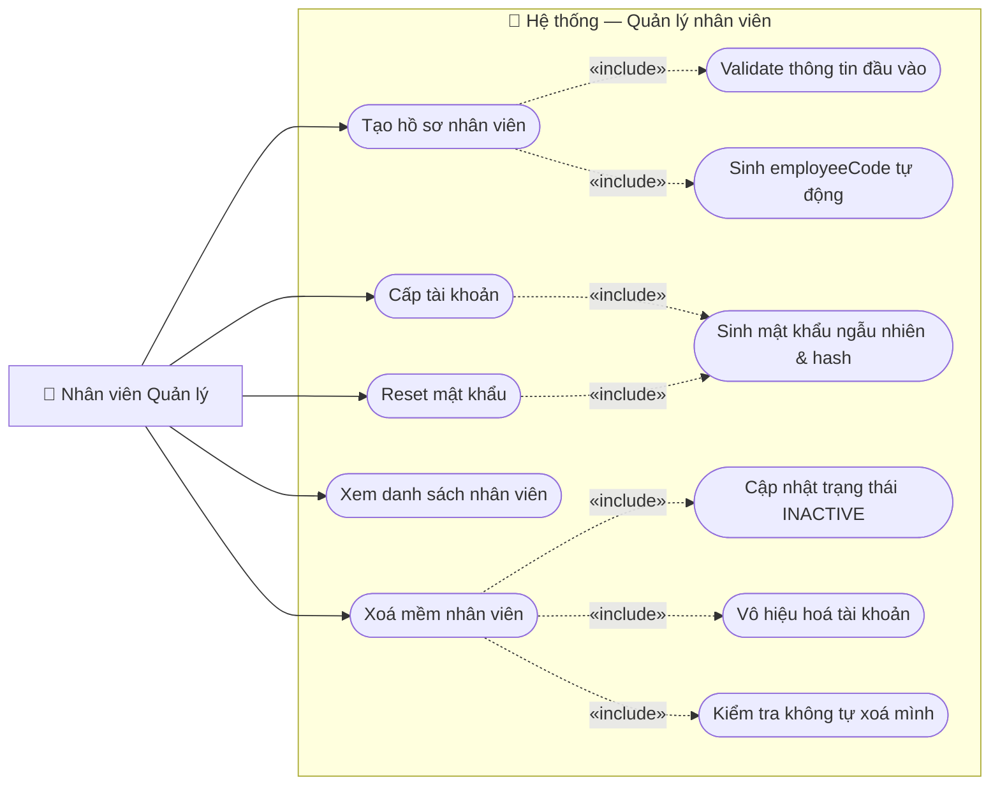

# Usecase: Quản lý nhân viên

## Actor
- **Primary:** Nhân viên Quản lý (isManager = true)
- **System:** Server, Database

## Mô tả
Nhân viên Quản lý có thể tạo hồ sơ nhân viên mới, cấp tài khoản đăng nhập cho nhân viên vừa tạo, và xoá mềm nhân viên bằng cách cập nhật trạng thái thành `INACTIVE` ("Đã nghỉ làm"). Usecase này quản lý toàn bộ vòng đời hồ sơ nhân viên trong hệ thống.

## Tiền điều kiện
- Người dùng đã đăng nhập thành công với tài khoản có `isManager = true`.

## Hậu điều kiện
- **Luồng A:** Hồ sơ nhân viên mới được tạo với trạng thái `ACTIVE`, `employeeCode` được sinh tự động.
- **Luồng B:** Tài khoản được tạo và liên kết với hồ sơ nhân viên; `username = employeeCode`, mật khẩu ngẫu nhiên (hash), `account.active = true`.
- **Luồng C:** Nhân viên bị xoá mềm với `employeeStatus = INACTIVE`, `account.active = false`, `updatedAt = ngày hiện tại`.

---

## Luồng chính

### Luồng A — Tạo hồ sơ nhân viên

1. Quản lý chọn chức năng **"Quản lý nhân viên"** tại giao diện chính.
2. Hệ thống hiển thị menu với các tuỳ chọn: **Tạo hồ sơ nhân viên**, **Xoá nhân viên**.
3. Quản lý chọn **Tạo hồ sơ nhân viên**.
4. Hệ thống hiển thị form nhập thông tin với các trường: Họ tên, CCCD (9 hoặc 12 số), Ngày sinh, Giới tính, Địa chỉ, Số điện thoại (10 số), Email, Loại nhân viên (Quản lý / Nhân viên thường).
5. Quản lý nhập đầy đủ thông tin và nhấn **Lưu**.
6. Hệ thống kiểm tra tính hợp lệ của dữ liệu:
   - Email đúng định dạng và chưa tồn tại.
   - SĐT đúng 10 chữ số.
   - CCCD là 9 hoặc 12 chữ số và chưa tồn tại.
   - Họ tên, Ngày sinh, Loại nhân viên không được để trống.
7. Hệ thống sinh `employeeCode` theo quy tắc nghiệp vụ (ví dụ: `NV001`, `QL002`), đặt `employeeStatus = ACTIVE`, `createdAt = ngày hiện tại`.
8. Hệ thống lưu hồ sơ nhân viên vào cơ sở dữ liệu.
9. Hệ thống hiển thị thông báo thành công kèm thông tin nhân viên vừa tạo, bao gồm `employeeCode` được sinh.

### Luồng B — Cấp tài khoản

1. Quản lý vào danh sách nhân viên, tìm nhân viên chưa có tài khoản, chọn **Cấp tài khoản**.
2. Hệ thống kiểm tra: nhân viên chưa được liên kết với tài khoản nào (`employee.account == null`).
3. Hệ thống tạo tài khoản mới với:
   - `username` = `employeeCode` của nhân viên (duy nhất, đọc được).
   - `password` = chuỗi ngẫu nhiên (được hash bằng bcrypt trước khi lưu).
   - `active = true`.
4. Hệ thống liên kết tài khoản với hồ sơ nhân viên (`employee.account = account`), cập nhật `employee.updatedAt = ngày hiện tại`.
5. Hệ thống lưu thay đổi trong một transaction.
6. Hệ thống hiển thị thông tin tài khoản tạm thời (username, mật khẩu ban đầu dạng plaintext) để Quản lý thông báo trực tiếp cho nhân viên. Mật khẩu này **chỉ hiển thị một lần duy nhất**.

### Luồng C — Xoá mềm nhân viên

1. Quản lý chọn chức năng **"Quản lý nhân viên"** tại giao diện chính.
2. Hệ thống hiển thị menu với các tuỳ chọn: Tạo hồ sơ nhân viên, **Xoá nhân viên**.
3. Quản lý chọn **Xoá nhân viên**.
4. Hệ thống hiển thị danh sách nhân viên đang hoạt động (`ACTIVE` hoặc `PAUSE`) có phân trang, bao gồm: mã nhân viên, họ tên, CCCD, email, SĐT, loại, trạng thái.
5. Quản lý tìm kiếm và chọn nhân viên cần xoá, nhấn **Xác nhận xoá**.
6. Hệ thống kiểm tra: Quản lý không được tự xoá mình (so sánh `employeeId` của người đang đăng nhập với nhân viên được chọn).
7. Hệ thống hiển thị hộp thoại xác nhận, nếu nhân viên có hoá đơn liên kết sẽ hiển thị cảnh báo thêm.
8. Quản lý xác nhận lần cuối.
9. Hệ thống cập nhật `employeeStatus = INACTIVE`, `account.active = false` (nếu tài khoản tồn tại), `updatedAt = ngày hiện tại`.
10. Hệ thống lưu thay đổi và hiển thị thông báo xoá mềm thành công.

### Luồng D — Reset mật khẩu

1. Quản lý chọn nhân viên trong danh sách và chọn **Reset mật khẩu**.
2. Hệ thống hiển thị hộp thoại xác nhận: "Bạn có chắc chắn muốn đặt lại mật khẩu cho nhân viên này?".
3. Quản lý xác nhận.
4. Hệ thống sinh một mật khẩu ngẫu nhiên mới, băm (hash) và lưu vào Database.
5. Hệ thống hiển thị mật khẩu mới dạng plaintext trên màn hình để quản lý gửi cho nhân viên. (Mật khẩu chỉ hiện 1 lần).

### Luồng E — Xem danh sách nhân viên

1. Quản lý vào màn hình Quản lý nhân viên.
2. Hệ thống load danh sách nhân viên có phân trang (mặc định: page 0, size 20), có thể lọc theo trạng thái (`ACTIVE` / `PAUSE` / `INACTIVE`).
3. Hệ thống hiển thị bảng danh sách kèm thông tin tóm tắt.

---

## Luồng thay thế

- **[Nhân viên đã có tài khoản — Luồng B, bước 2]:** Hệ thống hiển thị thông báo "Nhân viên đã được cấp tài khoản" và không tạo thêm; nút "Cấp tài khoản" bị ẩn hoặc disabled trên UI.
- **[Quản lý tự xoá mình — Luồng C, bước 6]:** Hệ thống từ chối và hiển thị lỗi "Bạn không thể xoá tài khoản của chính mình".
- **[Nhân viên có hoá đơn liên kết — Luồng C, bước 7]:** Hệ thống hiển thị cảnh báo "Nhân viên này đã xử lý [N] hoá đơn. Việc xoá mềm không ảnh hưởng đến lịch sử giao dịch."; Quản lý vẫn có thể tiếp tục xoá mềm sau khi xác nhận.

---

## Luồng lỗi

- **[Thiếu trường bắt buộc — Luồng A, bước 6]:** Hệ thống highlight các trường thiếu và hiển thị thông báo lỗi tương ứng; form không gửi lên server.
- **[Sai định dạng email — Luồng A, bước 6]:** "Email không đúng định dạng".
- **[Sai định dạng SĐT — Luồng A, bước 6]:** "Số điện thoại phải gồm đúng 10 chữ số".
- **[CCCD không hợp lệ — Luồng A, bước 6]:** "CCCD phải gồm 9 hoặc 12 chữ số".
- **[CCCD đã tồn tại — Luồng A, bước 6]:** "CCCD đã được đăng ký cho nhân viên khác".
- **[Email đã tồn tại — Luồng A, bước 6]:** "Email đã được sử dụng bởi tài khoản khác".
- **[Lỗi hệ thống khi lưu — Luồng A/B/C]:** Hệ thống rollback transaction, trả về "Lỗi hệ thống, vui lòng thử lại".

---

## Dữ liệu vào (Client → Server)

### Tạo hồ sơ nhân viên (`CREATE_EMPLOYEE`)
| Field | Kiểu | Bắt buộc | Mô tả |
|---|---|---|---|
| employeeName | String | ✓ | Họ và tên nhân viên |
| nationalId | String | ✓ | Số CCCD (9 hoặc 12 chữ số, duy nhất) |
| dateOfBirth | LocalDate | ✓ | Ngày sinh (yyyy-MM-dd) |
| gender | Boolean | ✓ | true = Nam, false = Nữ |
| address | String | ✗ | Địa chỉ thường trú |
| phoneNumber | String | ✓ | SĐT 10 chữ số |
| email | String | ✓ | Email hợp lệ, duy nhất |
| isManager | Boolean | ✓ | true = Quản lý, false = Nhân viên thường |

### Cấp tài khoản (`CREATE_EMPLOYEE_ACCOUNT`)
| Field | Kiểu | Bắt buộc | Mô tả |
|---|---|---|---|
| employeeId | String | ✓ | UUID của nhân viên cần cấp tài khoản |

### Xoá mềm nhân viên (`DELETE_EMPLOYEE`)
| Field | Kiểu | Bắt buộc | Mô tả |
|---|---|---|---|
| employeeId | String | ✓ | UUID của nhân viên cần xoá |

### Xem danh sách nhân viên (`FIND_ALL_EMPLOYEES`)
| Field | Kiểu | Bắt buộc | Mô tả |
|---|---|---|---|
| page | int | ✗ | Số trang (mặc định 0) |
| size | int | ✗ | Kích thước trang (mặc định 20) |
| statusFilter | EmployeeStatus | ✗ | Lọc theo trạng thái; null = lấy tất cả |

---

## Dữ liệu ra (Server → Client)

### Tạo hồ sơ nhân viên thành công
| Field | Kiểu | Mô tả |
|---|---|---|
| employeeId | String | UUID được sinh bởi hệ thống |
| employeeCode | String | Mã nhân viên nghiệp vụ (ví dụ: NV001) |
| employeeName | String | Họ tên nhân viên |
| nationalId | String | Số CCCD |
| dateOfBirth | LocalDate | Ngày sinh |
| gender | Boolean | Giới tính |
| address | String | Địa chỉ |
| phoneNumber | String | SĐT |
| email | String | Email |
| isManager | Boolean | Loại nhân viên |
| employeeStatus | String | Trạng thái: `ACTIVE` |
| createdAt | LocalDate | Ngày tạo hồ sơ |

### Cấp tài khoản thành công
| Field | Kiểu | Mô tả |
|---|---|---|
| username | String | Tên đăng nhập = employeeCode |
| temporaryPassword | String | Mật khẩu ban đầu dạng plaintext (chỉ trả về 1 lần) |

### Xoá mềm thành công
| Field | Kiểu | Mô tả |
|---|---|---|
| employeeId | String | UUID của nhân viên đã bị xoá mềm |
| employeeStatus | String | Trạng thái mới: `INACTIVE` |
| updatedAt | LocalDate | Ngày cập nhật |

### Danh sách nhân viên
| Field | Kiểu | Mô tả |
|---|---|---|
| content | List\<EmployeeDTO\> | Danh sách nhân viên trang hiện tại |
| totalElements | long | Tổng số nhân viên |
| totalPages | int | Tổng số trang |
| currentPage | int | Trang hiện tại |

---

## Business Rules

- Chỉ nhân viên có `isManager = true` mới được thực hiện các thao tác trong usecase này.
- `employeeCode` được sinh tự động theo quy tắc: `NV` + số thứ tự 3 chữ số (nhân viên thường), `QL` + số thứ tự (quản lý). Ví dụ: `NV001`, `QL001`. `employeeCode` là duy nhất và là username của account.
- CCCD (`nationalId`) phải là duy nhất — chấp nhận 9 hoặc 12 chữ số (CMND cũ và CCCD mới).
- Email phải là duy nhất trong hệ thống.
- SĐT phải gồm đúng 10 chữ số.
- Khi xoá mềm: chỉ cập nhật `employeeStatus = INACTIVE` và `account.active = false` — **không xoá bản ghi khỏi DB** (cần giữ lại cho lịch sử hoá đơn).
- Nhân viên có trạng thái `INACTIVE` không thể đăng nhập vào hệ thống (`account.active = false`).
- Mật khẩu tài khoản phải được hash (bcrypt) trước khi lưu — không lưu plaintext.
- `temporaryPassword` chỉ được trả về một lần duy nhất tại thời điểm cấp tài khoản; sau đó không thể truy xuất lại từ DB.
- Một nhân viên chỉ được cấp tối đa một tài khoản (`OneToOne` Employee–Account).
- Quản lý không thể tự xoá mềm tài khoản của chính mình.
- Mọi thao tác tạo / cập nhật phải đặt `updatedAt = LocalDate.now()`.

---

## Sơ đồ Use Case

---

## 🛠 Yêu cầu cập nhật Database / Entity / DTO (Từ BA Review)

### 1. `Employee` — Thêm field `employeeCode` (String, unique, not null)

**Lý do:** Usecase định nghĩa `username` của account = "mã nhân viên". Hiện tại entity không có mã nghiệp vụ, chỉ có UUID. Nếu dùng UUID làm username thì nhân viên phải gõ `550e8400-e29b-41d4-a716-446655440000` mỗi lần đăng nhập — không ai nhớ được và không thể vận hành thực tế. Cần có `employeeCode` dạng `NV001` / `QL002` để làm username có thể gõ được.

**Thay đổi:** Thêm `@Column(name = "employee_code", unique = true, nullable = false, length = 10) private String employeeCode;`

### 2. `Employee` — Thêm field `address` (String, nullable)

**Lý do:** Form tạo hồ sơ (Luồng A, bước 4) có trường Địa chỉ theo yêu cầu nghiệp vụ gốc. Entity không có trường này nên dữ liệu địa chỉ nhập vào sẽ bị mất hoàn toàn — không lưu được vào đâu. Địa chỉ cần thiết khi liên hệ nhân viên, gửi thông báo hành chính, hay đối chiếu hồ sơ nhân sự.

**Thay đổi:** Thêm `@Column(name = "address", columnDefinition = "NVARCHAR(255)") private String address;`

### 3. `Employee` — Sửa `nationalId` column length từ 11 → 12

**Lý do:** Từ năm 2021, toàn bộ CCCD Việt Nam chuyển sang 12 số. Entity hiện tại giới hạn `length = 11` sẽ reject mọi CCCD 12 số, khiến không thể tạo hồ sơ cho nhân viên có CCCD mới. CMND 9 số cũ vẫn còn hiệu lực theo pháp luật → cần chấp nhận cả 9 và 12 ký tự. Nếu không sửa, mọi nhân viên mới tuyển sau 2021 đều không thể được tạo hồ sơ.

**Thay đổi:** `@Column(name = "national_id", unique = true, nullable = false, length = 12)` + validate ở service layer: độ dài phải là 9 hoặc 12.

### 4. `EmployeeStatus` enum — Sửa lỗi chính tả trong label

**Lý do:** `PAUSE("Tạm nghĩ")` và `INACTIVE("Đã nghĩ làm")` đang dùng "nghĩ" (to think) thay vì "nghỉ" (to rest/leave). Nếu label này hiển thị trên giao diện hoặc báo cáo nhân sự, người dùng sẽ thấy nội dung vô nghĩa và mất tin tưởng vào hệ thống.

**Thay đổi:** `PAUSE("Tạm nghỉ")`, `INACTIVE("Đã nghỉ làm")`.