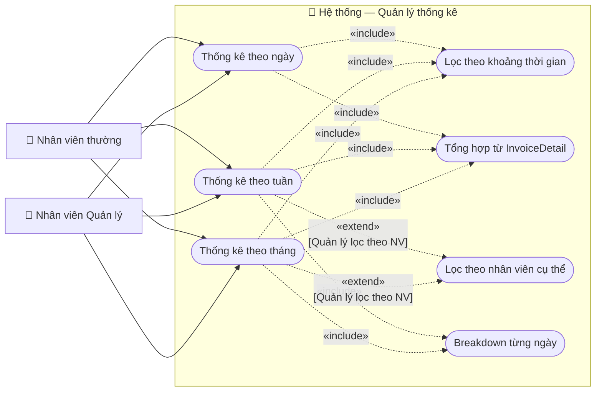

# Usecase: Quản lý thống kê

## Actor
- **Primary:** Nhân viên Quản lý (isManager = true), Nhân viên thường (isManager = false)
- **System:** Server, Database

## Mô tả
Hệ thống cho phép cả nhân viên thường và quản lý xem thống kê bán vé và doanh thu theo khoảng thời gian được chọn (ngày / tuần / tháng). Nhân viên thường chỉ xem thống kê giao dịch do chính mình xử lý; Quản lý xem toàn bộ hệ thống và có thể lọc thêm theo nhân viên. Dữ liệu thống kê được tổng hợp từ bảng `Invoice` và `InvoiceDetail`.

## Tiền điều kiện
- Người dùng đã đăng nhập thành công.

## Hậu điều kiện
- Kết quả thống kê (số vé bán, doanh thu, số vé hoàn, phí bảo hiểm, tổng giảm giá) hiển thị trên màn hình theo khoảng thời gian đã chọn.
- Nếu không có dữ liệu trong khoảng thời gian chọn, hiển thị thông báo phù hợp.

---

## Luồng chính

### Luồng chung — Vào màn hình thống kê

1. Người dùng chọn chức năng **"Quản lý thống kê"** tại giao diện chính.
2. Hệ thống hiển thị màn hình thống kê với 3 tab lựa chọn: **Theo ngày**, **Theo tuần**, **Theo tháng**.
3. Hệ thống xác định phạm vi dữ liệu theo vai trò:
   - Nếu `isManager = true` → lấy toàn bộ giao dịch trong hệ thống (không filter theo employee).
   - Nếu `isManager = false` → chỉ lấy giao dịch do nhân viên đó xử lý (`invoice.employee.id = currentEmployeeId`).
4. Người dùng chọn một trong 3 luồng con bên dưới.

### Luồng A — Thống kê theo ngày

1. Người dùng chọn tab **"Theo ngày"**.
2. Hệ thống hiển thị lịch chọn ngày, mặc định là ngày hiện tại.
3. Người dùng chọn ngày cần thống kê và nhấn **"Xem thống kê"**.
4. Hệ thống truy vấn tất cả `Invoice` có `issueDate` nằm trong ngày được chọn (00:00:00 → 23:59:59).
5. Hệ thống tổng hợp từ `InvoiceDetail` liên kết: số vé bán, tổng giảm giá, tổng phí bảo hiểm, số vé hoàn, tổng tiền hoàn.
6. Hệ thống trả về kết quả thống kê cho ngày đó (xem mục Dữ liệu ra).
7. Hệ thống hiển thị kết quả trên màn hình.

### Luồng B — Thống kê theo tuần

1. Người dùng chọn tab **"Theo tuần"**.
2. Hệ thống hiển thị lịch chọn tuần (chọn bất kỳ ngày trong tuần hoặc chọn số tuần / năm), mặc định là tuần hiện tại.
3. Người dùng chọn tuần cần thống kê và nhấn **"Xem thống kê"**.
4. Hệ thống xác định ngày bắt đầu (thứ Hai) và ngày kết thúc (Chủ nhật) của tuần được chọn theo chuẩn ISO-8601.
5. Hệ thống truy vấn tất cả `Invoice` có `issueDate` trong khoảng [startOfWeek 00:00:00, endOfWeek 23:59:59].
6. Hệ thống tổng hợp từ `InvoiceDetail`: tổng kỳ + breakdown từng ngày trong tuần.
7. Hệ thống hiển thị kết quả dạng bảng + biểu đồ cột 7 ngày.

### Luồng C — Thống kê theo tháng

1. Người dùng chọn tab **"Theo tháng"**.
2. Hệ thống hiển thị bộ chọn tháng + năm (MM/YYYY), mặc định là tháng hiện tại.
3. Người dùng chọn tháng và năm cần thống kê, nhấn **"Xem thống kê"**.
4. Hệ thống xác định ngày đầu tháng (ngày 1) và ngày cuối tháng.
5. Hệ thống truy vấn tất cả `Invoice` có `issueDate` trong tháng được chọn.
6. Hệ thống tổng hợp từ `InvoiceDetail`: tổng kỳ + breakdown từng ngày trong tháng.
7. Hệ thống hiển thị kết quả dạng bảng + biểu đồ cột theo ngày trong tháng.

---

## Luồng thay thế

- **[Quản lý lọc theo nhân viên cụ thể — Luồng A/B/C]:** Quản lý có thể chọn thêm bộ lọc "Nhân viên" từ dropdown; hệ thống thêm điều kiện `invoice.employee.id = selectedEmployeeId` vào truy vấn, ghi đè filter mặc định "toàn hệ thống".
- **[Muốn xuất báo cáo — Luồng A/B/C]:** Người dùng nhấn **"Xuất Excel / PDF"** sau khi xem kết quả; hệ thống tạo file báo cáo và cho phép download. <!-- TODO: cần bổ sung nếu tính năng này được yêu cầu -->

---

## Luồng lỗi

- **[Không có dữ liệu trong khoảng thời gian chọn]:** Hệ thống trả về kết quả với tất cả giá trị = 0 và hiển thị thông báo "Không có dữ liệu trong khoảng thời gian này".
- **[Ngày chọn trong tương lai — Luồng A]:** Hệ thống cho phép chọn nhưng kết quả rỗng — không có giao dịch tương lai; hiển thị "Không có dữ liệu".
- **[Lỗi hệ thống khi truy vấn]:** Hệ thống trả về thông báo "Lỗi hệ thống, vui lòng thử lại".

---

## Dữ liệu vào (Client → Server)

### Thống kê (`GET_STATISTICS`)
| Field | Kiểu | Bắt buộc | Mô tả |
|---|---|---|---|
| periodType | StatisticsPeriod | ✓ | Enum: `DAY`, `WEEK`, `MONTH` |
| targetDate | LocalDate | ✓ | Ngày đại diện cho kỳ (bất kỳ ngày trong tuần hoặc tháng) |
| employeeId | String | ✗ | UUID nhân viên cần lọc (chỉ Quản lý được truyền; nhân viên thường bị bỏ qua) |

---

## Dữ liệu ra (Server → Client)

### Kết quả thống kê (`StatisticsResultDTO` — DTO mới, cần tạo)
| Field | Kiểu | Mô tả |
|---|---|---|
| periodType | StatisticsPeriod | Loại kỳ: `DAY` / `WEEK` / `MONTH` |
| periodLabel | String | Nhãn hiển thị (ví dụ: "12/04/2026", "Tuần 15/2026", "Tháng 4/2026") |
| startDate | LocalDate | Ngày bắt đầu kỳ |
| endDate | LocalDate | Ngày kết thúc kỳ |
| totalTicketsSold | int | Tổng số vé bán = COUNT(InvoiceDetail) WHERE Invoice.type=SALE trong kỳ |
| totalTicketsRefunded | int | Tổng số vé hoàn = COUNT(InvoiceDetail) WHERE isReturned=true trong kỳ |
| totalTicketsBooked | int | Tổng số vé đặt chưa thanh toán (Ticket.status=BOOKED) trong kỳ |
| grossRevenue | BigDecimal | Doanh thu gộp = SUM(InvoiceDetail.subTotal) của Invoice.type=SALE trong kỳ |
| totalDiscount | BigDecimal | Tổng giảm giá = SUM(InvoiceDetail.discount) trong kỳ |
| totalInsurance | BigDecimal | Tổng phí bảo hiểm = SUM(InvoiceDetail.insurance) trong kỳ |
| refundAmount | BigDecimal | Tổng tiền hoàn = SUM(InvoiceDetail.refundAmount) WHERE isReturned=true trong kỳ |
| netRevenue | BigDecimal | Doanh thu thuần = grossRevenue − refundAmount |
| exchangeCount | int | Số lượng giao dịch đổi vé (Invoice.type=EXCHANGE) trong kỳ |
| breakdown | List\<DailyRevenueDTO\> | Chi tiết doanh thu từng ngày trong kỳ — **tái sử dụng DTO hiện có** (chỉ có khi WEEK hoặc MONTH) |

### `DailyRevenueDTO` (tái sử dụng DTO hiện có — `server/dto/DailyRevenueDTO.java`)
| Field | Kiểu | Mô tả |
|---|---|---|
| day | LocalDate | Ngày cụ thể |
| revenue | BigDecimal | Doanh thu thuần trong ngày |

> **Lưu ý:** `DailyRevenueDTO` hiện tại chỉ có `day` + `revenue`. Nếu UI cần thêm `ticketsSold` và `ticketsRefunded` theo từng ngày trong breakdown, cần thêm 2 field này vào `DailyRevenueDTO` (non-breaking, backward-compatible — giữ nguyên `serialVersionUID = 1L`).

> **Lưu ý:** `StatisticalDTO` hiện có (`routeId`, `routeName`, `totalTrips`, `occupancyRate`) phục vụ **báo cáo tần suất khai thác theo tuyến đường** — đây là usecase khác, không liên quan đến uc014.

---

## Business Rules

- **Phân quyền xem dữ liệu:** Nhân viên thường chỉ xem được thống kê giao dịch do chính họ xử lý (`invoice.employee.id`). Quản lý xem toàn bộ hệ thống, có thể lọc thêm theo một nhân viên cụ thể.
- **Nguồn dữ liệu chính:** Số vé và doanh thu được tính từ `InvoiceDetail`, không phải từ `Ticket.status` hay `Invoice.totalAmount` đơn thuần.
  - Số vé bán = COUNT(`InvoiceDetail`) liên kết với `Invoice.type = SALE` trong kỳ.
  - Số vé hoàn = COUNT(`InvoiceDetail.isReturned = true`) trong kỳ.
  - Doanh thu gộp = SUM(`InvoiceDetail.subTotal`) của SALE.
  - Tiền hoàn = SUM(`InvoiceDetail.refundAmount`) của các dòng `isReturned = true`.
- **Doanh thu thuần = grossRevenue − refundAmount** trong cùng kỳ. `EXCHANGE` không ảnh hưởng doanh thu.
- **Tuần bắt đầu từ thứ Hai** theo chuẩn ISO-8601.
- **Vé huỷ (`CANCELLED`)** không được tính vào số vé bán.
- **Kết quả không lưu vào DB** — thống kê được tính toán real-time mỗi lần truy vấn.
- **Không giới hạn khoảng thời gian lịch sử** — người dùng có thể xem bất kỳ ngày/tuần/tháng nào trong quá khứ.
- **Tất cả trường tiền tệ dùng `BigDecimal`** để đảm bảo độ chính xác tài chính.

---

## Sơ đồ Use Case

---

## 🛠 Yêu cầu cập nhật Database / Entity / DTO (Từ BA Review)

### 1. Thêm enum `StatisticsPeriod` vào `server/constant/`

**Lý do:** Usecase dùng `periodType` để phân biệt ngày/tuần/tháng. Nếu để là String thì client có thể gửi bất kỳ giá trị nào (`"daily"`, `"DAY"`, `"day"`) và server phải tự xử lý nhiều trường hợp, dễ bị lỗi runtime. Dùng enum `StatisticsPeriod { DAY, WEEK, MONTH }` thì Java sẽ báo lỗi ngay khi deserialize sai giá trị — an toàn hơn và đúng chuẩn protocol của dự án.

**Thêm mới:** `server/constant/StatisticsPeriod.java` với 3 giá trị: `DAY`, `WEEK`, `MONTH`.

### 2. Tạo `StatisticsRequestDTO` và `StatisticsResultDTO`; tái sử dụng `DailyRevenueDTO`

**Lý do:** Server cần class cụ thể để deserialize request và serialize response qua socket — không có DTO thì bị `ClassCastException` runtime.

- **`StatisticsRequestDTO`** (mới): chứa `periodType`, `targetDate`, `employeeId` — dùng để nhận request từ client.
- **`StatisticsResultDTO`** (mới): chứa toàn bộ kết quả tổng hợp kỳ — không DTO hiện có nào cover được (StatisticalDTO là theo tuyến đường, không phải theo thời gian).
- **`DailyRevenueDTO`** (tái sử dụng): đã có `day` + `revenue`, dùng làm breakdown. Nếu cần thêm `ticketsSold`/`ticketsRefunded` per ngày thì thêm field vào DTO này (giữ `serialVersionUID = 1L`).

> `StatisticalDTO` và `CustomerStatisticDTO` phục vụ các báo cáo khác (tuyến đường, hành vi khách) — không dùng cho usecase này.

### 3. Không cần thêm column mới vào DB — nhưng cần JPQL aggregate query từ `InvoiceDetail`

**Lý do:** Tất cả dữ liệu cần thiết đã có trong entity hiện tại (`InvoiceDetail.subTotal`, `.discount`, `.insurance`, `.isReturned`, `.refundAmount`). Không cần migration DB. Tuy nhiên Developer cần viết JPQL aggregate query tổng hợp từ `InvoiceDetail JOIN Invoice` với điều kiện `Invoice.issueDate BETWEEN :start AND :end`. Nếu nhầm source sang `Invoice.totalAmount` hoặc đếm `Ticket.status` thì số liệu thống kê sẽ sai — kế toán đối soát sẽ không khớp.
