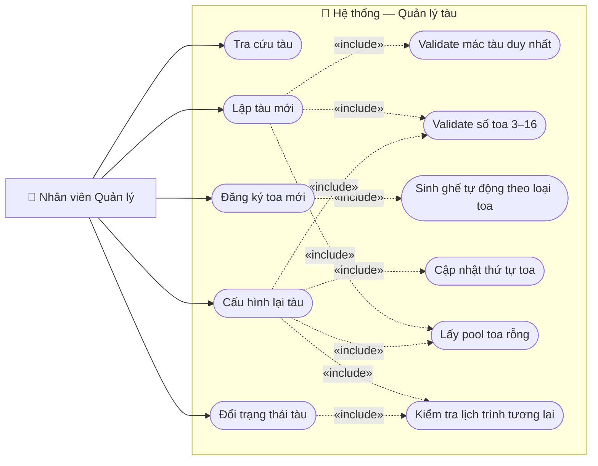

# Usecase: Quản lý tàu

## Actor
- **Primary:** Nhân viên Quản lý (isManager = true)
- **System:** Server, Database

## Mô tả
Nhân viên Quản lý có thể tra cứu tàu theo mác tàu, lập tàu mới với cấu hình toa ban đầu, đăng ký toa mới vào hệ thống (pool toa rỗng), cấu hình lại cấu trúc toa của một tàu đang có (thêm/bỏ toa theo vị trí), và thay đổi trạng thái tàu. Tất cả thay đổi cấu trúc toa đều bị block nếu tàu còn lịch trình tương lai chưa huỷ, và đều được kiểm tra ràng buộc số lượng toa (3–16) trước khi lưu.

## Tiền điều kiện
- Người dùng đã đăng nhập thành công với tài khoản có `isManager = true`.

## Hậu điều kiện
- **Luồng A:** Danh sách tàu khớp mác tàu được hiển thị, hoặc thông báo không tìm thấy.
- **Luồng B:** Tàu mới được tạo với mác tàu, trạng thái `ACTIVE`, và danh sách toa được gán.
- **Luồng D:** Toa mới được đăng ký vào hệ thống với loại toa và các ghế tự sinh; toa ở trạng thái "rỗng" (trainId = null).
- **Luồng E:** Cấu trúc toa của tàu được cập nhật (thứ tự toa mới, toa thêm/bỏ); các toa bị bỏ trở về pool toa rỗng.
- **Luồng F:** Trạng thái tàu được cập nhật (ACTIVE / MAINTENANCE / INACTIVE).

---

## Luồng chính

### Màn hình tổng quan Quản lý tàu

1. Quản lý chọn chức năng **"Quản lý tàu"** tại giao diện chính.
2. Hệ thống gọi `FIND_ALL_TRAINS` và hiển thị danh sách tất cả tàu có phân trang: mác tàu, trạng thái, số toa, số ghế. Có thể lọc theo `TrainStatus`.
3. Quản lý chọn một trong các hành động: Tra cứu, Lập tàu mới, Đăng ký toa mới, Cấu hình tàu, Đổi trạng thái tàu.

### Luồng A — Tra cứu tàu

1. Quản lý chọn **"Tra cứu tàu"** hoặc nhập vào ô tìm kiếm trên màn hình tổng quan.
2. Quản lý nhập mác tàu (ví dụ: SE, TN1) và nhấn **"Tìm kiếm"**.
3. Hệ thống truy vấn `Train` theo `trainCode` (tìm gần đúng LIKE, không phân biệt hoa thường).
4. Hệ thống hiển thị danh sách tàu khớp: mác tàu, trạng thái, số toa, số ghế tổng.
5. Quản lý chọn một tàu để xem chi tiết — hệ thống hiển thị sơ đồ các toa (theo `carriage.number`), loại toa, số ghế mỗi toa.

### Luồng B — Lập tàu mới

1. Quản lý chọn **"Lập tàu mới"**.
2. Hệ thống hiển thị form: ô nhập mác tàu + sơ đồ toa trống.
3. Quản lý nhập **mác tàu** (chỉ chứa chữ cái và số, tối đa 10 ký tự, ví dụ: SE5, TN2).
4. Hệ thống hiển thị danh sách toa rỗng trong pool (`trainId = null`), phân loại theo `CarriageType`.
5. Quản lý chọn và sắp xếp các toa theo thứ tự mong muốn vào sơ đồ tàu.
6. Quản lý nhấn **"Xác nhận"**.
7. Hệ thống kiểm tra:
   - Mác tàu chưa tồn tại trong DB (so sánh case-insensitive).
   - Số toa trong khoảng [3, 16].
   - Tất cả `carriageIds` có `trainId = null` (chưa bị gán cho tàu khác).
8. Hệ thống tạo `Train` mới (`trainCode`, `status = ACTIVE`), gán toa: `carriage.trainId = trainId`, `carriage.number = vị trí` (1-indexed).
9. Hệ thống hiển thị thông báo "Tàu [mác tàu] được tạo thành công".

### Luồng D — Đăng ký toa mới vào hệ thống

1. Quản lý chọn **"Đăng ký toa mới"**.
2. Hệ thống hiển thị form: dropdown chọn `CarriageType`, preview số ghế sẽ được sinh.
3. Quản lý chọn **loại toa**:
   - `HARD_SEAT` — Toa ngồi cứng: 64 ghế (`SeatType.HARD_SEAT`).
   - `SOFT_SEAT` — Toa ngồi mềm: 56 ghế (`SeatType.SOFT_SEAT`).
   - `SOFT_SEAT_AC` — Toa ngồi mềm cao cấp: 56 ghế (`SeatType.VIP_SEAT`).
   - `BERTH_6` — Toa giường 6: 42 giường (`SeatType.BERTH_6`).
   - `BERTH_4` — Toa giường 4: 36 giường (`SeatType.BERTH_4`).
4. Quản lý nhấn **"Lưu"**.
5. Hệ thống tạo `Carriage` mới (`type`, `trainId = null`, `number = 0`) trong một transaction, đồng thời sinh toàn bộ `Seat` tương ứng với `number` từ 1 đến N.
6. Hệ thống hiển thị thông báo "Toa mới đã được đăng ký vào hệ thống".

### Luồng E — Cấu hình lại tàu (thêm/bỏ toa)

1. Quản lý chọn **"Cấu hình tàu"**, chọn tàu cần cấu hình từ danh sách.
2. Hệ thống kiểm tra: tàu có bất kỳ `Schedule` nào với `departureTime > now` và `status != CANCELLED` không.
   - Nếu có → **block toàn bộ luồng**, hiển thị "Không thể cấu hình tàu đang có lịch trình trong tương lai".
   - Nếu không → tiếp tục.
3. Hệ thống hiển thị form Cấu hình tàu với sơ đồ toa hiện tại (theo `carriage.number`).
4. Quản lý thực hiện một hoặc nhiều thao tác:

   **Thêm toa (E.1):**
   1. Quản lý nhấn **"+"** tại vị trí muốn chèn.
   2. Hệ thống hiển thị danh sách toa rỗng (`trainId = null`), phân loại theo `CarriageType`.
   3. Quản lý chọn toa, xem preview số ghế, nhấn **"Thêm"**.
   4. Hệ thống chèn toa vào vị trí `k`; tăng `number` của các toa có `number >= k` lên 1.

   **Bỏ toa (E.2):**
   1. Quản lý chọn toa trong sơ đồ, nhấn **"Bỏ toa"**.
   2. Hệ thống set `carriage.trainId = null`, `carriage.number = 0`; giảm `number` của các toa phía sau xuống 1.

5. Quản lý nhấn **"Lưu"**.
6. Hệ thống kiểm tra tổng số toa còn lại trong khoảng [3, 16].
7. Nếu hợp lệ, hệ thống commit toàn bộ thay đổi trong một transaction.
8. Hệ thống hiển thị "Cấu hình tàu đã được cập nhật".
9. Quản lý nhấn **"Thoát"** để đóng form.

### Luồng F — Thay đổi trạng thái tàu

1. Quản lý chọn tàu từ danh sách, nhấn **"Đổi trạng thái"**.
2. Hệ thống hiển thị dropdown: `ACTIVE`, `MAINTENANCE`, `INACTIVE`.
3. Quản lý chọn trạng thái mới và xác nhận.
4. Nếu chuyển sang `INACTIVE` hoặc `MAINTENANCE`: hệ thống kiểm tra tàu không có `Schedule` tương lai chưa huỷ.
5. Hệ thống cập nhật `train.status` và hiển thị thông báo thành công.

---

## Luồng thay thế

- **[Thoát có lưu — Luồng E]:** Quản lý nhấn "Thoát" khi có thay đổi chưa lưu → hệ thống hỏi "Lưu trước khi thoát?". Nếu "Có" → thực hiện bước 6-8 rồi thoát. Nếu "Không" → huỷ mọi thay đổi, không ghi vào DB.
- **[Pool toa rỗng trống — Luồng E.1 / B]:** Không có toa nào có `trainId = null` → hệ thống hiển thị "Không có toa trống, vui lòng đăng ký toa mới trước".
- **[Xem chi tiết tàu → chuyển sang Cấu hình — Luồng A]:** Từ màn hình chi tiết tàu, Quản lý có thể chọn "Cấu hình tàu" để chuyển thẳng vào Luồng E.

---

## Luồng lỗi

- **[Mác tàu trùng lặp — Luồng B, bước 7]:** "Mác tàu [SE5] đã tồn tại, vui lòng chọn mác khác".
- **[Số toa < 3 — Luồng B/E]:** "Tàu phải có tối thiểu 3 toa".
- **[Số toa > 16 — Luồng B/E]:** "Tàu không được vượt quá 16 toa".
- **[Tàu có lịch trình tương lai — Luồng E bước 2 / Luồng F bước 4]:** "Không thể thay đổi tàu đang có lịch trình trong tương lai. Vui lòng huỷ các lịch trình liên quan trước".
- **[Toa đã thuộc tàu khác — Luồng B bước 7]:** "Một hoặc nhiều toa đã được gán cho tàu khác, vui lòng tải lại danh sách toa".
- **[Không tìm thấy tàu — Luồng A]:** "Không tìm thấy tàu với mác [...]".
- **[Lỗi hệ thống khi lưu]:** Hệ thống rollback transaction, trả về "Lỗi hệ thống, vui lòng thử lại".

---

## Dữ liệu vào (Client → Server)

### Lấy danh sách tàu (`FIND_ALL_TRAINS`)
| Field | Kiểu | Bắt buộc | Mô tả |
|---|---|---|---|
| statusFilter | TrainStatus | ✗ | Lọc theo trạng thái; null = tất cả |

### Tra cứu tàu (`FIND_TRAIN_BY_CODE`)
| Field | Kiểu | Bắt buộc | Mô tả |
|---|---|---|---|
| trainCode | String | ✓ | Từ khoá tìm kiếm (LIKE, case-insensitive) |

### Lấy danh sách toa rỗng (`FIND_UNASSIGNED_CARRIAGES`)
| Field | Kiểu | Bắt buộc | Mô tả |
|---|---|---|---|
| _(không có tham số)_ | — | — | Trả về Carriage có trainId = null |

### Lập tàu mới (`CREATE_TRAIN`)
| Field | Kiểu | Bắt buộc | Mô tả |
|---|---|---|---|
| trainCode | String | ✓ | Mác tàu (chữ + số, tối đa 10 ký tự, duy nhất) |
| carriageIds | List\<String\> | ✓ | UUID toa theo thứ tự vị trí (index 0 = toa số 1) |

### Đăng ký toa mới (`CREATE_CARRIAGE`)
| Field | Kiểu | Bắt buộc | Mô tả |
|---|---|---|---|
| carriageType | CarriageType | ✓ | HARD_SEAT / SOFT_SEAT / SOFT_SEAT_AC / BERTH_6 / BERTH_4 |

### Cập nhật cấu hình tàu (`UPDATE_TRAIN_CARRIAGES`)
| Field | Kiểu | Bắt buộc | Mô tả |
|---|---|---|---|
| trainId | String | ✓ | UUID tàu cần cấu hình lại |
| carriageIds | List\<String\> | ✓ | UUID toa theo thứ tự vị trí mới (toàn bộ danh sách sau khi thêm/bỏ) |

### Đổi trạng thái tàu (`UPDATE_TRAIN_STATUS`)
| Field | Kiểu | Bắt buộc | Mô tả |
|---|---|---|---|
| trainId | String | ✓ | UUID tàu |
| status | TrainStatus | ✓ | Trạng thái mới: ACTIVE / MAINTENANCE / INACTIVE |

---

## Dữ liệu ra (Server → Client)

### Thông tin tàu (`TrainDTO` — cần mở rộng)
| Field | Kiểu | Mô tả |
|---|---|---|
| id | String | UUID tàu |
| trainCode | String | Mác tàu (SE1, TN1, …) |
| status | TrainStatus | Trạng thái tàu |
| totalCarriages | int | Số toa hiện tại |
| totalSeats | int | Tổng số ghế trên tàu |
| carriages | List\<CarriageDTO\> | Danh sách toa theo thứ tự (chỉ có khi xem chi tiết) |

### Thông tin toa (`CarriageDTO` — hiện có, đủ dùng)
| Field | Kiểu | Mô tả |
|---|---|---|
| id | String | UUID toa |
| number | int | Thứ tự trong tàu (1-indexed; 0 = toa rỗng) |
| type | CarriageType | Loại toa |
| trainId | String | UUID tàu; null = toa rỗng |

---

## Business Rules

- Chỉ nhân viên có `isManager = true` mới được thực hiện các thao tác trong usecase này.
- **`trainCode`** chỉ chứa chữ cái và chữ số (không dấu cách, không ký tự đặc biệt), tối đa 10 ký tự, phân biệt hoa thường khi lưu nhưng kiểm tra trùng theo case-insensitive.
- Mỗi tàu phải có **tối thiểu 3 toa** và **tối đa 16 toa** — kiểm tra tại bước lưu.
- **Toa rỗng** = `Carriage` có `trainId = null`. Pool dùng chung; không thuộc tàu nào.
- **Không được cấu hình lại tàu** (Luồng E) nếu tàu đó có bất kỳ `Schedule` nào với `departureTime > now` và `status != CANCELLED`. Toàn bộ luồng E bị block — không chỉ block riêng toa.
- Khi **thêm toa tại vị trí k**: `number` của toa phía sau ≥ k được tăng 1; toa mới được gán `number = k`.
- Khi **bỏ toa**: `trainId = null`, `number = 0`; các toa còn lại được cập nhật lại `number` liên tục.
- Toàn bộ Luồng E phải nằm trong **một transaction** — rollback nếu ràng buộc số toa không thoả.
- Khi **đăng ký toa mới** (Luồng D), hệ thống tự động sinh toàn bộ `Seat` theo loại toa (số lượng ghế cố định theo loại toa như trên) — không để nhập thủ công.
- `carriageIds` gửi lên phải là toa có `trainId = null` — server validate trước khi gán; nếu có toa đã bị gán bởi giao dịch song song thì rollback toàn bộ.
- Tàu có `status = INACTIVE` không được xếp vào lịch trình mới (`Schedule`).

---

## Sơ đồ Use Case

---

## 🛠 Yêu cầu cập nhật Database / Entity / DTO (Từ BA Review)

### 1. `Train` entity — Thêm field `trainCode` (String, unique, not null, length=10)

**Lý do:** Toàn bộ usecase vận hành xung quanh "mác tàu" (SE1, TN1, SNT1...). Đây là định danh nghiệp vụ mà Quản lý, Nhân viên và hành khách đều biết. Nếu không có trường này, hệ thống chỉ có UUID như `550e8400-e29b-41d4-a716-446655440000` — không ai có thể tìm được tàu SE1 hay biết tàu nào đang hiển thị. Nhân viên bán vé khi chọn tàu cho khách sẽ không biết cái nào là SE1 hay SE3.

**Thay đổi:** Thêm `@Column(name = "train_code", unique = true, nullable = false, length = 10) private String trainCode;` vào `Train.java`.

### 2. `TrainDTO` — Thêm `trainCode`, `totalCarriages`, `totalSeats`, `carriages`

**Lý do:** `TrainDTO` hiện tại chỉ có `id` + `status`. Client nhận về response này sẽ chỉ thấy một UUID và trạng thái — không hiển thị được gì cho Quản lý. Cần `trainCode` để hiển thị tên, `totalCarriages`/`totalSeats` cho màn hình danh sách, và `carriages` cho màn hình chi tiết/cấu hình. Nếu không có, UI chỉ toàn UUID không có ý nghĩa.

**Thay đổi:** Cập nhật `TrainDTO.java` thêm các field trên. `carriages` chỉ populate khi xem chi tiết (lazy), để tránh load toàn bộ dữ liệu khi chỉ hiển thị danh sách.

### 3. Business rule mới: Block cấu hình tàu khi có lịch trình tương lai

**Lý do:** Nếu không kiểm tra, kịch bản sau sẽ xảy ra: Quản lý bỏ toa số 3 của tàu SE1 trong khi tàu SE1 có chuyến khởi hành ngày mai với 50 khách đã mua vé ngồi toa 3. Khi khách lên tàu, toa 3 không còn tồn tại hoặc đã bị thay bằng toa khác có ghế số khác nhau → toàn bộ 50 vé đó không hợp lệ, khách không có chỗ ngồi, đường sắt phải bồi thường. Đây là lỗi vận hành nghiêm trọng nhất trong hệ thống đặt vé.

**Thay đổi:** Service layer phải query `SELECT COUNT(s) FROM Schedule s WHERE s.train.id = :trainId AND s.departureTime > :now AND s.status != CANCELLED` trước khi cho phép bất kỳ thay đổi nào ở Luồng E và F (chuyển sang INACTIVE/MAINTENANCE).
