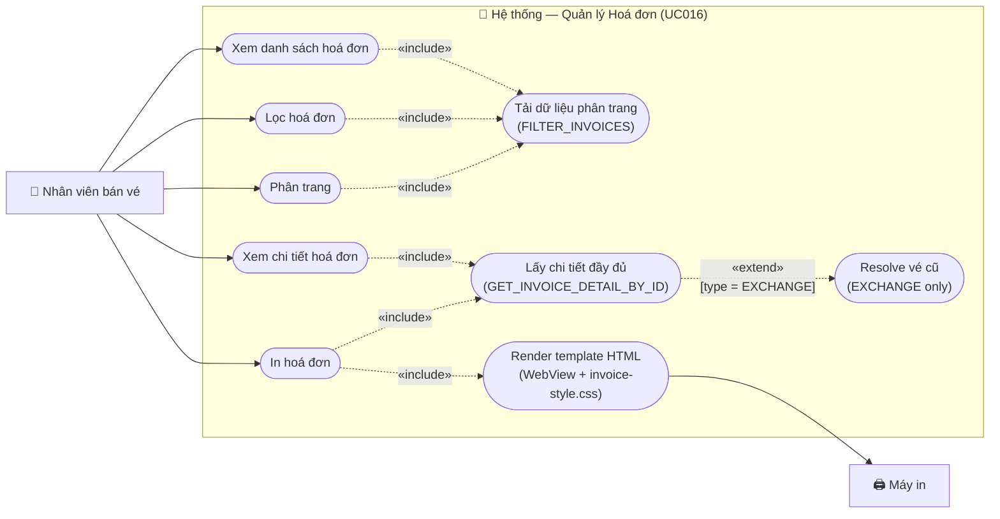

# Usecase: Quản lý hoá đơn

## Actor
- **Primary:** Nhân viên bán vé (Employee)
- **System:** Server, Database

## Mô tả
Cho phép nhân viên xem lại danh sách toàn bộ hoá đơn đã phát sinh trong hệ thống (bán vé, đổi vé, trả vé), lọc theo nhiều tiêu chí kết hợp (từ khoá, ngày/tháng/năm, loại hoá đơn, nhân viên xử lý), xem chi tiết từng hoá đơn và in hoá đơn khi cần thiết. Usecase này **chỉ đọc** — không tạo mới hoá đơn (việc tạo thuộc UC001/UC002/UC003).

## Tiền điều kiện
- Nhân viên đã đăng nhập thành công.
- Tồn tại ít nhất một hoá đơn trong hệ thống (tạo từ UC001, UC002, UC003).

## Hậu điều kiện
- Danh sách hoá đơn phù hợp với bộ lọc được hiển thị, phân trang, sắp xếp mới nhất trước.
- Nếu nhân viên chọn xem chi tiết: toàn bộ thông tin hoá đơn và các dòng vé (tên hành khách, CCCD, tuyến, ghế, giá) được hiển thị.
- Nếu nhân viên chọn in: hoá đơn được render đầy đủ thông tin và gửi lệnh in thành công.

---

## Luồng chính — Xem danh sách hoá đơn

1. Nhân viên chọn chức năng **"Quản lý Hoá đơn"** tại giao diện chính.
2. Hệ thống gửi yêu cầu `FILTER_INVOICES` lên server với bộ lọc mặc định (không có điều kiện lọc, trang 0, kích thước trang 20, sắp xếp `issueDate DESC`).
3. Server áp dụng phân quyền:
   - Nếu `employee.isManager = false` → tự động thêm điều kiện `invoice.employee.id = currentEmployeeId`.
   - Nếu `employee.isManager = true` → không giới hạn, lấy toàn bộ hệ thống.
4. Server truy vấn bảng `invoices` JOIN `customers`, `employees`, đếm `invoice_details` per invoice, áp dụng điều kiện phân trang và sắp xếp.
5. Server trả về `InvoicePageDTO` (danh sách `InvoiceSummaryDTO` + metadata phân trang).
6. Hệ thống hiển thị danh sách lên `TableView` với các cột: Mã HĐ, Nhân viên, Khách hàng, Ngày phát sinh, Loại, Tổng tiền, Số vé.
7. Nhân viên tiếp tục theo một trong các luồng phụ bên dưới.

---

## Luồng phụ A — Lọc hoá đơn

1. Nhân viên nhập một hoặc nhiều tiêu chí lọc:
   - **Từ khoá:** mã hoá đơn (prefix match) hoặc tên khách hàng (LIKE search).
   - **Ngày:** chọn ngày cụ thể (dd) — lọc tất cả HĐ trong ngày đó.
   - **Tháng:** chọn tháng (MM) — lọc tất cả HĐ trong tháng đó.
   - **Năm:** chọn năm (YYYY) — lọc tất cả HĐ trong năm đó.
   - **Loại hoá đơn:** `SALE` / `REFUND` / `EXCHANGE` hoặc "Tất cả".
   - **Nhân viên xử lý** (chỉ hiển thị khi `isManager = true`): chọn từ ComboBox danh sách nhân viên — lọc HĐ của nhân viên cụ thể.
2. Nhân viên nhấn **"Lọc"**.
3. Hệ thống reset về trang 0, gửi yêu cầu `FILTER_INVOICES` với `InvoiceFilterDTO` đầy đủ tiêu chí.
4. Server xây dựng JPQL động với các điều kiện `AND` kết hợp:
   - `LOWER(i.id) LIKE :keyword OR LOWER(c.fullName) LIKE :keyword` (nếu có keyword, so sánh không phân biệt hoa thường)
   - `DAY(i.issueDate) = :day` (nếu chọn ngày)
   - `MONTH(i.issueDate) = :month` (nếu chọn tháng)
   - `YEAR(i.issueDate) = :year` (nếu chọn năm)
   - `i.type = :type` (nếu chọn loại HĐ cụ thể)
   - `i.employee.employeeId = :filterEmployeeId` (nếu manager chọn nhân viên cụ thể)
5. Server trả về kết quả lọc, sắp xếp `issueDate DESC`.
6. Hệ thống cập nhật `TableView` và điều khiển phân trang.

---

## Luồng phụ B — Xem chi tiết hoá đơn

1. Nhân viên click vào một dòng trong bảng.
2. Hệ thống mở dialog chi tiết hoá đơn (`InvoiceDetailDialog`).
3. Hệ thống gửi yêu cầu `GET_INVOICE_DETAIL_BY_ID` với `invoiceId` lên server.
4. Server thực hiện:
   - Truy vấn `Invoice` JOIN FETCH `Customer`, `Employee`.
   - Với mỗi `InvoiceDetail`: JOIN FETCH `Ticket` → lấy `passengerName`, `passengerIdCard`, `ticketType`; JOIN FETCH `ScheduleDetail` → `segmentDepartureStation`, `segmentDestinationStation`, `seat` → `Carriage` → `Train` (để có tên tàu, toa, loại ghế, giờ khởi hành).
   - **Riêng cho hoá đơn EXCHANGE:** với mỗi vé mới, server tra thêm `Ticket.originalTicketId` để resolve thông tin vé cũ (ghế đã trả lại: ga đi/đến, tàu cũ, toa/ghế cũ, giờ khởi hành cũ).
5. Server trả về `InvoiceDetailResponseDTO` đầy đủ (xem mục Dữ liệu ra).
6. Hệ thống render thông tin vào dialog:
   - Header: Mã HĐ, ngày phát sinh, loại HĐ, thông tin KH (tên, SĐT), thông tin NV, thông tin VAT (nếu có).
   - Bảng dòng vé: tên hành khách, CCCD, tên tàu, toa/ghế, tuyến đường, ngày giờ khởi hành, loại đối tượng, giá gốc, giảm giá, phí bảo hiểm, thành tiền, trạng thái hoàn.
   - **Với HĐ EXCHANGE:** thêm cột "Vé cũ" để hiển thị thông tin ghế đã trả lại.
   - Footer: dòng tổng cộng, phần chữ ký.
7. Nhân viên xem xong, đóng dialog hoặc tiếp tục luồng In (Luồng phụ C).

---

## Luồng phụ C — In hoá đơn

1. Nhân viên nhấn **"In hoá đơn"** (từ dialog chi tiết hoặc từ nút trong bảng).
2. Nếu chưa có dữ liệu chi tiết: hệ thống tải `GET_INVOICE_DETAIL_BY_ID` trước (như Luồng B bước 3–5).
3. Hệ thống render template HTML hoá đơn bằng `WebEngine` (JavaFX `WebView`), áp dụng `invoice-style.css`:
   - **SALE:** mỗi dòng vé hiển thị tên hành khách, CCCD, tuyến, tàu/toa/ghế, giờ đi, đối tượng, đơn giá, giảm giá, bảo hiểm, thành tiền.
   - **REFUND:** thêm dòng "Hoàn tiền" với `refundAmount` từng vé, tổng số tiền hoàn lại.
   - **EXCHANGE:** hiển thị 2 section — "Vé cũ thu hồi" và "Vé mới phát hành" — để thể hiện rõ giao dịch đổi.
4. Hệ thống gọi `PrinterJob` của JavaFX để gửi lệnh in.
5. Hộp thoại chọn máy in hệ thống hiện lên (native OS print dialog).
6. Nhân viên chọn máy in và xác nhận.
7. Hệ thống in hoá đơn thành công, hiển thị thông báo "In hoá đơn thành công".

---

## Luồng phụ D — Phân trang

1. Nhân viên nhấn **"◄"** (trang trước) hoặc **"►"** (trang sau).
2. Hệ thống cập nhật `currentPage`, giữ nguyên bộ lọc hiện tại, gửi lại `FILTER_INVOICES`.
3. Hệ thống cập nhật `TableView` và nhãn trang "X / Y".
4. Nút **"◄"** bị vô hiệu hoá khi đang ở trang đầu; nút **"►"** bị vô hiệu hoá khi đang ở trang cuối.

---

## Luồng thay thế

- **[Nhấn "Làm mới" — bất kỳ luồng phụ nào]:** Hệ thống xóa toàn bộ bộ lọc, reset về trang 0, tải lại dữ liệu mặc định.
- **[Tìm kiếm real-time — từ khoá]:** Nếu ô tìm kiếm có listener `textProperty`, hệ thống tự động gửi lại request sau mỗi lần thay đổi mà không cần nhấn nút "Lọc".
- **[Kết quả rỗng sau lọc]:** Hệ thống hiển thị `TableView` trống và thông báo "Không tìm thấy hoá đơn phù hợp với tiêu chí đã chọn". Bộ lọc vẫn được giữ nguyên để nhân viên điều chỉnh.
- **[Xuất file — không hỗ trợ trong phiên bản này]:** Tính năng xuất PDF/Excel không nằm trong phạm vi UC016. Sẽ được bổ sung trong phiên bản tiếp theo nếu có yêu cầu.

---

## Luồng lỗi

- **[Mất kết nối server — bất kỳ bước nào]:** Hệ thống hiển thị Alert lỗi "Không thể kết nối đến server. Vui lòng thử lại." và ẩn loading overlay.
- **[Server trả về `success=false`]:** Hệ thống hiển thị thông báo lỗi từ `response.getMessage()`.
- **[`invoiceId` không tồn tại — Luồng B]:** Server trả về lỗi "Không tìm thấy hoá đơn: id=xxx". Hệ thống hiển thị Alert và đóng dialog.
- **[Không có máy in — Luồng C]:** Hệ thống hiển thị Alert "Không tìm thấy máy in. Vui lòng kiểm tra cài đặt máy in." và hủy lệnh in.
- **[Lỗi render WebView — Luồng C]:** Hệ thống hiển thị Alert "Không thể tạo bản in. Vui lòng thử lại." và log lỗi.
- **[Vé gốc của EXCHANGE không còn trong hệ thống — Luồng B/C]:** Server ghi log warn, render phần "Vé cũ" với ghi chú "Không tìm thấy thông tin vé gốc" thay vì báo lỗi toàn trang.

---

## Dữ liệu vào (Client → Server)

### Lọc hoá đơn (`FILTER_INVOICES`)

| Field | Kiểu | Bắt buộc | Mô tả |
|---|---|---|---|
| `keyword` | `String` | ✗ | Tìm theo mã HĐ (prefix) hoặc tên KH (LIKE) |
| `day` | `Integer` | ✗ | Ngày phát sinh (1–31); null = không lọc theo ngày |
| `month` | `Integer` | ✗ | Tháng phát sinh (1–12); null = không lọc theo tháng |
| `year` | `Integer` | ✗ | Năm phát sinh (VD: 2025); null = không lọc theo năm |
| `type` | `InvoiceType` | ✗ | SALE / REFUND / EXCHANGE; null = tất cả |
| `filterEmployeeId` | `String` | ✗ | Chỉ dùng khi `isManager = true`; lọc theo nhân viên cụ thể |
| `page` | `int` | ✓ | Trang hiện tại (0-based), mặc định 0 |
| `size` | `int` | ✓ | Kích thước trang, mặc định 20 |

### Xem chi tiết hoá đơn (`GET_INVOICE_DETAIL_BY_ID`)

| Field | Kiểu | Bắt buộc | Mô tả |
|---|---|---|---|
| `invoiceId` | `String` | ✓ | UUID của hoá đơn cần xem chi tiết |

---

## Dữ liệu ra (Server → Client)

### Kết quả lọc (`FILTER_INVOICES`) — `InvoicePageDTO`

| Field | Kiểu | Mô tả |
|---|---|---|
| `content` | `List<InvoiceSummaryDTO>` | Danh sách hoá đơn tóm tắt của trang hiện tại |
| `totalPages` | `int` | Tổng số trang |
| `totalElements` | `long` | Tổng số hoá đơn khớp điều kiện |
| `currentPage` | `int` | Trang hiện tại (0-based) |

**Mỗi `InvoiceSummaryDTO`:**

| Field | Kiểu | Mô tả |
|---|---|---|
| `id` | `String` | Mã hoá đơn (UUID) |
| `issueDate` | `LocalDateTime` | Ngày giờ phát sinh |
| `totalAmount` | `double` | Tổng tiền |
| `type` | `InvoiceType` | Loại hoá đơn |
| `customerName` | `String` | Tên khách hàng |
| `employeeName` | `String` | Tên nhân viên xử lý |
| `ticketCount` | `int` | Số lượng vé trong hoá đơn |

### Chi tiết hoá đơn (`GET_INVOICE_DETAIL_BY_ID`) — `InvoiceDetailResponseDTO`

**Header hoá đơn:**

| Field | Kiểu | Mô tả |
|---|---|---|
| `id` | `String` | Mã hoá đơn |
| `issueDate` | `LocalDateTime` | Ngày giờ phát sinh |
| `totalAmount` | `double` | Tổng tiền |
| `type` | `InvoiceType` | SALE / REFUND / EXCHANGE |
| `customerId` | `String` | ID khách hàng |
| `customerName` | `String` | Tên khách hàng |
| `customerPhoneNumber` | `String` | SĐT khách hàng (map từ `customer.phoneNumber`) |
| `employeeId` | `String` | ID nhân viên |
| `employeeName` | `String` | Tên nhân viên (map từ `employee.employeeName`) |
| `taxCode` | `String` | Mã số thuế (nullable — chỉ có khi xuất VAT) |
| `companyName` | `String` | Tên công ty xuất VAT (nullable) |
| `details` | `List<InvoiceLineItemDTO>` | Danh sách dòng vé chi tiết |

**Mỗi `InvoiceLineItemDTO` (dòng vé chi tiết — thay thế `InvoiceDetailDTO` cho phần in):**

| Field | Kiểu | Mô tả |
|---|---|---|
| `id` | `String` | Mã dòng chi tiết |
| `invoiceId` | `String` | ID hoá đơn cha |
| `ticketId` | `String` | Mã vé |
| `passengerName` | `String` | Tên hành khách (từ `Ticket.passengerName`) |
| `passengerIdCard` | `String` | Số CCCD hành khách (từ `Ticket.passengerIdCard`) |
| `ticketType` | `TicketType` | Đối tượng: NORMAL / CHILD / SENIOR / STUDENT |
| `trainName` | `String` | Tên tàu (từ `ScheduleDetail → Seat → Carriage → Train.trainName`) |
| `carriageName` | `String` | Tên/số toa (từ `Carriage.carriageName`) |
| `seatCode` | `String` | Mã ghế (từ `Seat.seatCode`) |
| `departureStation` | `String` | Ga đi (từ `ScheduleDetail.segmentDepartureStation.stationName`) |
| `arrivalStation` | `String` | Ga đến (từ `ScheduleDetail.segmentDestinationStation.stationName`) |
| `departureTime` | `LocalDateTime` | Giờ khởi hành (từ `Schedule.departureTime` của ScheduleDetail) |
| `subTotal` | `Double` | Giá vé gốc |
| `discount` | `double` | Số tiền giảm giá |
| `insurance` | `double` | Phí bảo hiểm |
| `finalAmount` | `double` | Thành tiền = subTotal - discount + insurance |
| `isReturned` | `boolean` | Vé này đã được hoàn chưa |
| `refundAmount` | `double` | Số tiền hoàn (nếu isReturned = true) |
| `originalTicketInfo` | `OriginalTicketInfoDTO` | **Chỉ có với HĐ EXCHANGE** — thông tin vé cũ đã thu hồi |

**`OriginalTicketInfoDTO` (chỉ dùng trong HĐ EXCHANGE):**

| Field | Kiểu | Mô tả |
|---|---|---|
| `originalTicketId` | `String` | Mã vé cũ (từ `Ticket.originalTicketId`) |
| `originalTrainName` | `String` | Tên tàu cũ |
| `originalCarriageName` | `String` | Toa cũ |
| `originalSeatCode` | `String` | Số ghế cũ |
| `originalDepartureStation` | `String` | Ga đi vé cũ |
| `originalArrivalStation` | `String` | Ga đến vé cũ |
| `originalDepartureTime` | `LocalDateTime` | Giờ khởi hành vé cũ |

---

## Business Rules

- **BR01 — Chỉ đọc:** Usecase này không cho phép tạo, sửa, hoặc xoá hoá đơn. Toàn bộ hoá đơn được tạo tự động từ UC001, UC002, UC003.
- **BR02 — Phân quyền xem:** Nhân viên thường (`employee.isManager = false`) chỉ được xem hoá đơn do chính mình xử lý. Nhân viên quản lý (`employee.isManager = true`) xem toàn bộ hệ thống và có thể lọc theo nhân viên bất kỳ qua `filterEmployeeId`.
- **BR03 — Lọc kết hợp AND:** Tất cả tiêu chí lọc là tuỳ chọn và `AND` với nhau. Không có tiêu chí nào = lấy tất cả (trong phạm vi quyền của nhân viên).
- **BR04 — Loại hoá đơn:** Hệ thống chỉ có 3 loại: `SALE` (UC001), `EXCHANGE` (UC002), `REFUND` (UC003).
- **BR05 — In hoá đơn theo loại:**
  - `SALE`: hiển thị đầy đủ thông tin hành khách + vé + tổng tiền + phần VAT (nếu có `taxCode`).
  - `REFUND`: hiển thị thông tin vé + cột số tiền hoàn lại + tổng tiền hoàn + ghi chú phí trả vé.
  - `EXCHANGE`: hiển thị section "Vé thu hồi" (thông tin từ `originalTicketInfo`) và section "Vé mới phát hành" với chênh lệch giá và phí đổi vé.
- **BR06 — Thứ tự hiển thị mặc định:** `issueDate DESC` — hoá đơn mới nhất hiện trước.
- **BR07 — Phân trang:** Kích thước trang mặc định 20. Server luôn trả về `totalPages` và `totalElements`.
- **BR08 — Thông tin VAT:** `taxCode` và `companyName` chỉ hiển thị trên template in nếu khác null. Nếu null → bỏ qua phần VAT trong template.
- **BR09 — Mapping field name:** `customerPhoneNumber` trong DTO map từ `customer.phoneNumber` (không phải `customerPhone`). `employeeName` map từ `employee.employeeName`.

---

## ActionType cần bổ sung

| ActionType | Mô tả |
|---|---|
| `FILTER_INVOICES` | Lọc + phân trang danh sách hoá đơn |
| `GET_INVOICE_DETAIL_BY_ID` | Lấy chi tiết đầy đủ một hoá đơn theo ID |

---

## DTO cần bổ sung / cập nhật

| DTO | Trạng thái | Ghi chú |
|---|---|---|
| `InvoiceFilterDTO` | **Mới** | keyword, day, month, year, type, filterEmployeeId, page, size |
| `InvoiceSummaryDTO` | **Mới** | id, issueDate, totalAmount, type, customerName, employeeName, ticketCount |
| `InvoicePageDTO` | **Mới** | content, totalPages, totalElements, currentPage |
| `InvoiceDetailResponseDTO` | **Mới** | Header hoá đơn đầy đủ (thay thế `InvoiceDTO` cho phần chi tiết) |
| `InvoiceLineItemDTO` | **Mới** | Dòng vé chi tiết phục vụ in — gồm đầy đủ thông tin hành khách + tuyến + ghế |
| `OriginalTicketInfoDTO` | **Mới** | Thông tin vé cũ đã thu hồi — chỉ dùng với HĐ EXCHANGE |
| `InvoiceDTO` | **Giữ nguyên** | Vẫn dùng cho UC001/002/003 (create); UC016 dùng `InvoiceDetailResponseDTO` riêng |

---

## Sơ đồ Use Case

---

## 🛠 Yêu cầu cập nhật Database / Entity / DTO (Từ BA Review)

### 1. `InvoiceLineItemDTO` — Bắt buộc tạo mới (thay cho `InvoiceDetailDTO` trong luồng in)

**Lý do:** Khi nhân viên in hoá đơn cho khách, mỗi dòng vé phải thể hiện rõ: in ra là cho ai (tên + CCCD), đi tàu nào (tên tàu), toa ghế số bao nhiêu, đi từ đâu đến đâu, giờ mấy. Đây không phải yêu cầu kỹ thuật mà là **yêu cầu nghiệp vụ bắt buộc của đường sắt Việt Nam** — vé phải mang tên người đi. Nếu chỉ có `ticketId` trong `InvoiceDetailDTO`, nhân viên in ra tờ hoá đơn không có tên hành khách, không có số ghế, không có giờ tàu — khách sẽ không nhận được hoá đơn hợp lệ.

**Mapping cần thiết:** `InvoiceDetail → Ticket (passengerName, passengerIdCard, ticketType) + ScheduleDetail → Seat → Carriage → Train` để lấy đủ thông tin.

### 2. `OriginalTicketInfoDTO` — Bắt buộc tạo mới (chỉ cho HĐ EXCHANGE)

**Lý do:** Khi khách đổi vé, hệ thống tạo hoá đơn EXCHANGE. Trên hoá đơn này cần ghi rõ: "Thu hồi vé tàu SE1 toa 3 ghế 5A ngày 20/5, phát hành vé mới tàu SE3 toa 2 ghế 7B ngày 22/5, phí đổi = X đồng, chênh lệch giá = Y đồng". Nếu không có `OriginalTicketInfoDTO`, phần "Thu hồi" sẽ trống rỗng — hoá đơn EXCHANGE trở nên vô nghĩa về mặt kế toán và khách có thể khiếu nại vì không biết mình đã trả lại ghế nào.

**Cách resolve:** Server lấy `Ticket.originalTicketId` → tra cứu ScheduleDetail của vé cũ → lấy thông tin ghế/tàu/tuyến cũ. Nếu vé gốc đã bị xóa (hiếm gặp), ghi log warn và để `originalTicketInfo = null`.

### 3. `InvoiceSummaryDTO.ticketCount` — Bắt buộc bổ sung

**Lý do:** Trong danh sách hoá đơn, nhân viên cần biết nhanh "hoá đơn này có mấy vé" để xác định đúng giao dịch trước khi click vào xem chi tiết. Đặc biệt khi một khách mua 5-6 vé cho gia đình, hoá đơn đó có `totalAmount` rất lớn nhưng nhân viên cần kiểm tra số vé để đối chiếu với phiếu thu tiền. Thiếu trường này buộc phải mở từng chi tiết mới biết — mất thời gian.

### 4. `InvoiceFilterDTO.filterEmployeeId` — Bắt buộc bổ sung

**Lý do:** Cuối ca làm việc, giám sát (manager) cần đối soát "nhân viên A hôm nay bán được bao nhiêu hoá đơn, tổng tiền là bao nhiêu". Nếu không có trường này, manager chỉ có thể xem tất cả hoá đơn của cả hệ thống rồi đọc từng dòng để lọc bằng mắt — không thực tế khi có hàng trăm giao dịch/ngày.

### 5. Không cần thay đổi Entity nào

Tất cả thông tin cần thiết đã có trong các entity hiện tại:
- `Ticket`: có `passengerName`, `passengerIdCard`, `ticketType`, `originalTicketId` ✅
- `ScheduleDetail`: có `segmentDepartureStation`, `segmentDestinationStation`, `seat` ✅
- `Employee`: có `isManager`, `employeeName` ✅
- `Customer`: có `phoneNumber` (chú ý: map thành `customerPhoneNumber` trong DTO, không phải `customerPhone`) ✅
- `Invoice`: có `taxCode`, `companyName`, `issueDate`, `totalAmount` ✅